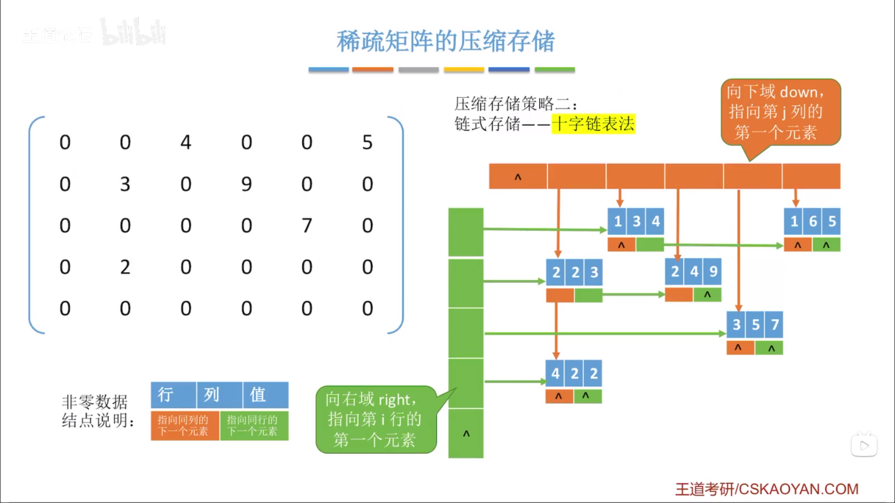

# 矩阵的压缩存储

## 1. 一维数组

个数组元素大小相同，且物理上连续存放。

数据元素 $s[i]$ 存放地址为 $LOC+i*sizeof(ElemType)$。

> 除非题目特别说明，否则数组下标默认从 0 开始。

## 2. 二维数组

$b[M][N]$

- 行优先存储。$b[i][j]$ 的存储地址为 $LOC+(i*N+j)*sizeof(ElemType)$。
- 列优先存储。$b[i][j]$ 的存储地址为 $LOC+(j*M+i)*sizeof(ElemType)$。

## 3. 对称矩阵

若 $n$ 阶**方阵**中任意一个元素 $a_{i,j}$ 都有 $a_{i,j}=a_{j,i}$，则该矩阵为对称矩阵。

- 主对角线
- 上三角区
- 下三角区

存储：

- 普通存储：$n \times n$ 二维数组
- 压缩存储策略：
  - 只存储主对角线+下三角区
  - 只存储主对角线+上三角区

按照**行优先**原则将各个元素存入一维数组中，该一维数组长度为 $\frac{n \times (n+1)}{2}$。

$$
B[0],B[1],B[2],B[3],...,B[\frac{n \times (n+1)}{2}-1]
$$

映射函数：

- $i \geq j$ 情况，$a_{i,j}$ 对应 $B[\frac{i \times (i-1)}{2}+j-1]$
- $i \lt j$ 情况，$a_{i,j}$ 对应 $B[\frac{j \times (j-1)}{2}+i-1]$

出题方法：

- 存储上三角？下三角？
- 行优先？列优先？
- 矩阵元素的下标从 0？1？开始
- 数组下标从 0？1？开始

## 4. 三角矩阵

- 下三角矩阵：除了主对角线和下三角区，其余的元素都相同。
- 上三角矩阵：除了主对角线和上三角区，其余的元素都相同。

### 4.1. 下三角矩阵的映射函数

$$
B[0],B[1],B[2],B[3],...,B[\frac{n \times (n+1)}{2}-1],B[\frac{n \times (n+1)}{2}]
$$

- $i \geq j$ 情况，$a_{i,j}$ 对应 $B[\frac{i \times (i-1)}{2}+j-1]$
- $i \lt j$ 情况，$a_{i,j}$ 对应 $B[\frac{n \times (n+1)}{2}]$

### 4.2. 上三角矩阵的映射函数

- $i \leq j$ 情况，$a_{i,j}$ 对应 $B[\frac{(i-1) \times (2n-i+2)}{2}+(j-i)]$
- $i \gt j$ 情况，$a_{i,j}$ 对应 $B[\frac{n \times (n+1)}{2}]$

## 5. 三对角矩阵

三对角矩阵，又称带状矩阵。

当 $|i-j|>1$ 时，$a_{i,j}=0$ （$1 \leq i, j \leq n$）。

### 5.1. 从矩阵到数组

行优先原则，只存储带状部分。数组大小为 $3n-2$。

$$
a_{1,1},a_{1,2},
a_{2,1},a_{2,2},a_{2,3},
a_{3,2},a_{3,3},a_{3,4},
...,
a_{n,n-1},a_{n,n},
$$

$$
B[0],B[1],B[2],B[3],...,B[3n-3]
$$

- 前 $i-1$ 行共 $3(i-1)-1$ 个元素。
- $a_{i,j}$ 是第 $i$ 行第 $j-i+2$ 个元素。
- $a_{i,j}$ 是第 $2i+j-2$ 个元素。
- 数组下标从 $0$ 开始，所以 $a_{i,j}$ 对应 $B[2i+j-3]$

### 5.2. 从数组到矩阵

若已知数组下标 $k$，如何得到 $i,j$？

数组下标从 $0$ 开始，所以该问题是问第 $k+1$ 个元素，在第几行？第几列？

- 前 $i-1$ 行共 $3(i-1)-1$ 个元素。
- 前 $i$ 行共 $3i-1$ 个元素。
- 显然：$3(i-1)-1 \lt k+1 \leq 3i-1$

$$
i \geq (k+2)/3
$$

向上取整得到 $i$。

> 或 $3(i-1)-1 \leq k \lt 3i-1$，结果为 $i \leq (k+1)/3+1$，向下取整得到 $i$。

## 6. 稀疏矩阵

稀疏矩阵：非零元素远远少于矩阵元素的个数。

### 6.1. 顺序存储

三元组 `<行，列，值>`。

$$
\left(
\begin{matrix}
0 & 0 & 4 & 0 & 0 & 0 & 5\\
0 & 3 & 0 & 0 & 9 & 0 & 0\\
0 & 0 & 0 & 0 & 0 & 7 & 0\\
0 & 2 & 0 & 0 & 0 & 0 & 0\\
0 & 0 & 0 & 0 & 0 & 0 & 0
\end{matrix}
\right)
$$

| i（行） | j（列） | v（值） |
| ------- | ------- | ------- |
| 1       | 3       | 4       |
| 1       | 6       | 5       |
| 2       | 2       | 3       |
| 2       | 4       | 9       |
| 3       | 5       | 7       |
| 4       | 2       | 2       |

### 6.2. 十字链表法

