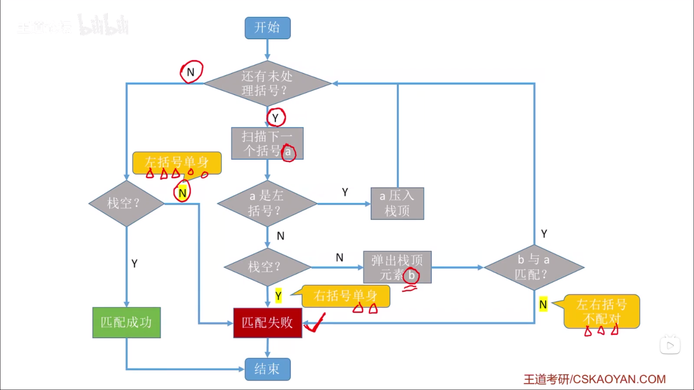

# 栈的应用

## 1. 括号匹配

```cpp
({([])}[])
```

最后出现的左括号最先被匹配（后进先出，LIFO）。每出现一个右括号，就“消耗”（出栈）一个左括号。

- 遇到左括号就入栈。
- 遇到右括号，就出栈一个左括号。



实现思路：

1. 依次扫描所有字符。
2. 遇到左括号入栈。
3. 遇到右括号则弹出栈顶元素，检查是否匹配。

匹配失败的情况：

- 左括号单身：所有括号都检查完了，但是栈非空。
- 右括号单身：扫描到右括号，但是此时栈空。
- 左右括号不匹配：栈顶左括号，与当前的右括号不匹配。

```cpp
bool bracketCheck(char str[], int length)
{
    SqStack S;
    InitStack(S);
    for (int i = 0; i < length; i++)
    {
        if (str[i] == '(' || str[i] == '[' || str[i] == '{')
        {
            Push(S, str[i]);
        }
        else
        {
            if (StackEmpty(S))
            {
                return false;
            }
            char topElem;
            Pop(S, topElem);
            if (str[i] == ')' && topElem != '(')
            {
                return false;
            }
            if (str[i] == ']' && topElem != '[')
            {
                return false;
            }
            if (str[i] == '}' && topElem != '{')
            {
                return false;
            }
        }
    }
    return StackEmpty(S);
}
```

## 2. 表达式求值

$$
((15 \div (7 - (1 + 1))) \times 3) - (2 + (1 + 1))
$$

构成：

- 操作数
- 运算符
- 界限符

**后缀表达式** = 逆波兰表达式（Reverse Polish notation）

前缀表达式 = 波兰表达式（Polish notation）

| 中缀表达式         | 后缀表达式         | 前缀表达式         |
| ------------------ | ------------------ | ------------------ |
| $$a+b$$            | $$ab+$$            | $$+ab$$            |
| $$a+b-c$$          | $$ab+c-$$          | $$-+abc$$          |
| $$a+b-c \times d$$ | $$ab+cd \times -$$ | $$-+ab \times cd$$ |

### 2.1. 后缀表达式

**中缀转后缀**的手算方法：

1. 确定中缀表达式中各个运算符的运算顺序
2. 选择下一个运算符，按照【左操作数 右操作数 运算符】的方式组合成一个新的操作数
3. 如果还有运算符没被处理，转 2

```cpp
// 中缀表达式
((15 / (7 - (1 + 1))) * 3) - (2 + (1 + 1))
// 后缀表达式
15 7 1 1 + - / 3 * 2 1 1 + + -
```

```cpp
// 中缀表达式
A + B * (C - D) - E / F
// 后缀表达式
A B C D - * + E F / -
// 另一种后缀表达式
A B C D - * E F / - +
```

**“左优先”原则**：只要左边的运算符能先计算，就优先算左边的。引入“左优先”原则后，中缀转后缀的结果就是唯一的。

```cpp
// 中缀表达式
A + B - C * D / E + F
// 后缀表达式
A B + C D * E / - F +
```

后缀表达式的手算方法：

从左往右扫描，每遇到一个操作符，就让运算符前面最近的两个操作数执行对应运算，合体为一个操作数。

用栈实现后缀表达式的计算：

1. 从左往右扫描下一个元素，直到处理完所有元素。
2. 若扫描到操作数则压入栈，并回到 1，否则执行 3。
3. 若扫描到运算符，则弹出两个栈顶元素，执行响应运算，运算结果压回栈顶，回到 1。

第三步中，先弹出右操作数，后弹出左操作数。

> 后缀表达式适用于基于栈的编程语言（stack-oriented programing language），如：Forth、PostScript。

### 2.2. 前缀表达式

**中缀转前缀**的手算方法：

1. 确定中缀表达式中各个运算符的运算顺序
2. 选择下一个运算符，按照【运算符 左操作数 右操作数】的方式组合成一个新的操作数
3. 如果还有运算符没被处理，转 2

**“右优先”原则**：只要右边的运算符能先计算，就优先算右边的。

```cpp
// 中缀表达式
A + B * (C - D) - E / F
// 前缀表达式
+ A - * B - C D / E F
```

```cpp
// 中缀表达式
((15 / (7 - (1 + 1))) * 3) - (2 + (1 + 1))
// 前缀表达式
- * / 15 - 7 + 1 1 3 + 2 + 1 1
```

用栈实现前缀表达式的计算：

1. 从右向左扫描下一个元素，直到处理完所有元素。
2. 若扫描到操作数则压入栈，并回到 1，否则执行 3。
3. 若扫描到运算符，则弹出两个栈顶元素，执行响应运算，运算结果压回栈顶，回到 1。

第三步中，先弹出左操作数，后弹出右操作数。

### 2.3. 用栈实现

#### 2.3.1. 中缀表达式转后缀表达式（机算）

初始化一个栈，用于保存暂时还不能确定运算顺序的运算符。

从左到右处理各个元素，知道末尾，可能遇到三种情况：

- 遇到操作数，直接加入后缀表达式。
- 遇到界限符。
  - 遇到 "(" 直接入栈。
  - 遇到 ")" 则依次弹出站内运算符并加入后缀表达式，直到弹出 "(" 为止。"(" 不加入后缀表达式。
- 遇到运算符。依次弹出栈中优先级高于或等于当前运算符的所有运算符，并加入后缀表达式，若碰到 "(" 或栈空则停止。之后再把当前运算符入栈。

按上述方法处理完所有字符后，将栈中剩余运算符依次弹出，并加入后缀表达式。

#### 2.3.2. 中缀表达式求值（用栈实现）

$$
中缀表达式求值 = 中缀转后缀 + 后缀表达式求值
$$

初始化两个栈，操作数栈和运算符栈。

若扫描到操作数，压入操作数栈。

若扫描到运算符或界限符，则按照“中缀转后缀”相同的逻辑压入运算符栈（期间也会弹出运算符，每当弹出一个运算符时，就需要再弹出两个操作数栈的栈顶元素并执行相应运算，运算结果再压回操作数栈）

## 3. 递归

### 3.1. 函数调用

函数调用的特点：最后被调用的函数最先执行结束。（FIFO）

函数调用时，需要用一个栈存储：

1. 调用返回地址
2. 实参
3. 局部变量

### 3.2. 递归算法

适合用“递归”算法解决：可以把原始问题转换为属性相同，但规模更小的问题。

- 计算正整数的阶乘。
- 计算斐波那契数列。

实现递归表达式：

- 递归表达式（递归体）
- 边界条件（递归出口）

```cpp
int factorial(int n)
{
    if (n == 0 || n == 1)
    {
        return 1;
    }
    else
    {
        return n * factorial(n-1);
    }
}
```

递归调用时，函数调用栈可称为“递归工作栈”。

- 每进入一层递归，就将递归调用所需的信息压入栈顶。
- 每退出一层递归，就从栈顶弹出相应信息。

```cpp
int Fib(int n)
{
    if (n == 0)
    {
        return 0;
    }
    else if (n == 1)
    {
        return 1;
    }
    else
    {
        return Fib(n-1) * Fib(n-2);
    }
}
```

递归缺点：

- 太多层递归可能会导致栈溢出。
- 可能包含很多重复计算。

可以自定义栈，将递归算法改造成非递归算法。
