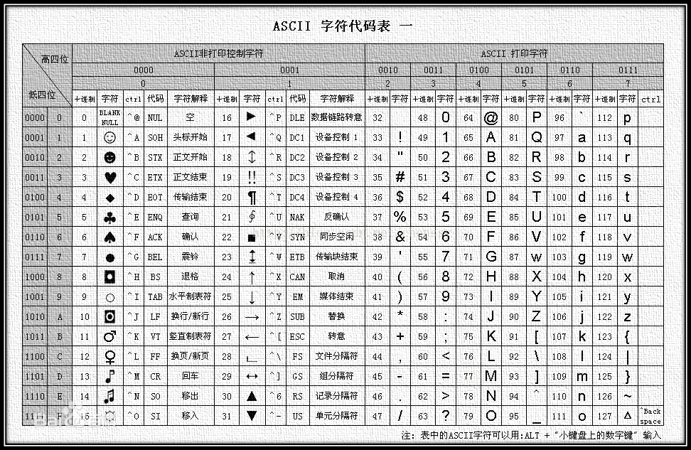

# 串

## 1. 定义

串，即字符串（String）是由零个或者多个字符组成的有序序列。一般记为：

$$
S='a_{1}a_{2}...a_{n}'（n>0）
$$

- $S$ 为串名。单引号（或双引号）括起来的字符序列是串的值。
- $a_{1}$ 可以是字母、数字或其他字符。
- 串中字符的个数 $n$ 为串的长度。
- $n=0$ 时的串称为空串（用 $\varnothing$ 表示）。

### 1.1. 相关概念

- 子串：串中人一个连续的字符组成的子序列。
- 主串：包含子串的串。
- 字符在主串中的位置：字符在串中的序号。
- 子串在主串中的位置：子串的第一个字符在主串中的位置。

位置/位序从 1 开始，而不是从 0 开始。

### 1.2. 空串 V.S 空格串

```cpp
M=""
```

```cpp
N="   "
```

### 1.3. 串 V.S 线性表

串是一种特殊的线性表，数据元素之间呈线性关系。

串的数据对象限定为字符集，如：中文字符、英文字符、数字字符、标点字符等。

串的基本操作，如增删改查等通常以**子串**为操作对象。

## 2. 基本操作

- `StrAssign(&T, chars)`：赋值操作。把串 $T$ 赋值为 $chars$。
- `StrCopy(&T, S)`：复制操作。由 $S$ 复制得到串 $T$。
- `StrEmpty(S)`：判空操作。若 $S$ 为空串，则返回 `true`，否则返回 `false`。
- `StrLength(S)`：求串长。返回串 $S$ 的元素个数。
- `ClearString(&S)`：清空操作。将串 $S$ 清为空串。
- `DestroyString(&S)`：销毁串。将串 $S$ 销毁（回收存储空间）。
- `Concat(&T, S1, S2)`：串连接。用 $T$ 返回由 $S1$ 和 $S2$ 连接而成的新串。
- `SubString(&Sub, S, pos, len)`：求子串。用 $Sub$ 返回串 $S$ 的第 $pos$ 个字符起长度为 $len$ 的字符串。
- `Index(S, T)`：定位操作。若主串 $S$ 中存在与串 $T$ 值相同的子串，则返回它在主串 $S$ 中第一次出现的位置，否则返回函数值 0。
- `StrCompare(S, T)`：比较操作。若 $S>T$，则返回值 $>0$；若 $S=T$，则返回值 $=0$；若 $S<T$，则返回值 $<0$。

### 2.1. 编码



任何数据存到计算机中一定是二进制数。

需要确定一个字符和二进制数的对应规则，这就是“编码”。

### 2.2. 字符集

- 英文字符：ASCII 字符集
- 中英文：Unicode 字符集

基于同一个字符集，可可以有多种编码方案，如：UTF-8，UTF-16。

> 采用不同的编码方式，每个字符所占空间空间不同，考验中只需要默认每个字符占 1B 即可。

### 2.3. 乱码问题

在你的文件中，原本采用某一套编码规则 $y=f(x)$。

打开文件时，你的软件以为你采用的是另一套编码规则 $y=g(x)$。
