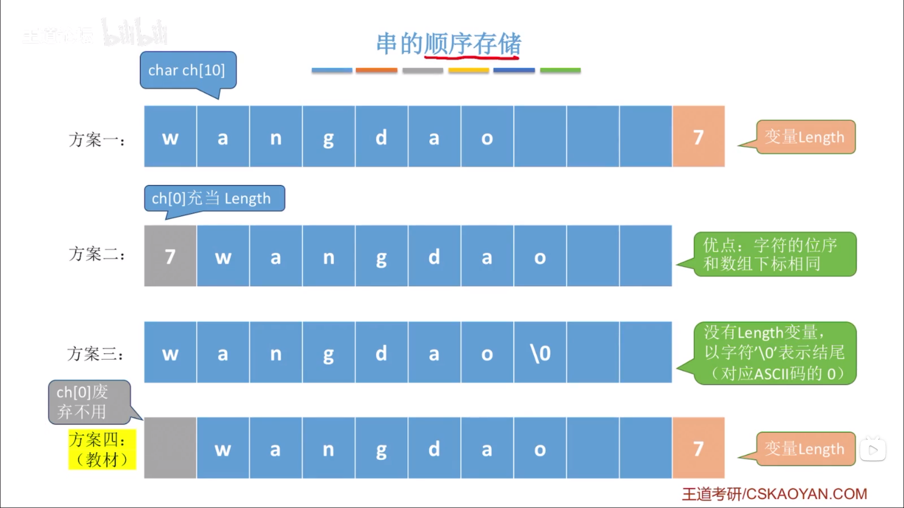

# 串

## 1. 定义

串，即字符串（String）是由零个或者多个字符组成的有序序列。一般记为：

$$
S='a_{1}a_{2}...a_{n}'（n>0）
$$

- $S$ 为串名。单引号（或双引号）括起来的字符序列是串的值。
- $a_{1}$ 可以是字母、数字或其他字符。
- 串中字符的个数 $n$ 为串的长度。
- $n=0$ 时的串称为空串（用 $\varnothing$ 表示）。

### 1.1. 相关概念

- 子串：串中人一个连续的字符组成的子序列。
- 主串：包含子串的串。
- 字符在主串中的位置：字符在串中的序号。
- 子串在主串中的位置：子串的第一个字符在主串中的位置。

位置/位序从 1 开始，而不是从 0 开始。

### 1.2. 空串 V.S 空格串

```cpp
M=""
```

```cpp
N="   "
```

### 1.3. 串 V.S 线性表

串是一种特殊的线性表，数据元素之间呈线性关系。

串的数据对象限定为字符集，如：中文字符、英文字符、数字字符、标点字符等。

串的基本操作，如增删改查等通常以**子串**为操作对象。

## 2. 基本操作

- `StrAssign(&T, chars)`：赋值操作。把串 $T$ 赋值为 $chars$。
- `StrCopy(&T, S)`：复制操作。由 $S$ 复制得到串 $T$。
- `StrEmpty(S)`：判空操作。若 $S$ 为空串，则返回 `true`，否则返回 `false`。
- `StrLength(S)`：求串长。返回串 $S$ 的元素个数。
- `ClearString(&S)`：清空操作。将串 $S$ 清为空串。
- `DestroyString(&S)`：销毁串。将串 $S$ 销毁（回收存储空间）。
- `Concat(&T, S1, S2)`：串连接。用 $T$ 返回由 $S1$ 和 $S2$ 连接而成的新串。
- `SubString(&Sub, S, pos, len)`：求子串。用 $Sub$ 返回串 $S$ 的第 $pos$ 个字符起长度为 $len$ 的字符串。
- `Index(S, T)`：定位操作。若主串 $S$ 中存在与串 $T$ 值相同的子串，则返回它在主串 $S$ 中第一次出现的位置，否则返回函数值 0。
- `StrCompare(S, T)`：比较操作。若 $S>T$，则返回值 $>0$；若 $S=T$，则返回值 $=0$；若 $S<T$，则返回值 $<0$。

### 2.1. 编码


任何数据存到计算机中一定是二进制数。

需要确定一个字符和二进制数的对应规则，这就是“编码”。

### 2.2. 字符集

- 英文字符：ASCII 字符集
- 中英文：Unicode 字符集

基于同一个字符集，可可以有多种编码方案，如：UTF-8，UTF-16。

> 采用不同的编码方式，每个字符所占空间空间不同，考验中只需要默认每个字符占 1B 即可。

### 2.3. 乱码问题

在你的文件中，原本采用某一套编码规则 $y=f(x)$。

打开文件时，你的软件以为你采用的是另一套编码规则 $y=g(x)$。

## 3. 串的存储结构

### 3.1. 顺序存储

#### 3.1.1. 静态数组实现（定长顺序存储）

```cpp
#define MAXLEN 255
typedef struct
{
    char ch[MAXLEN];
    int length;
} SString;
```

#### 3.1.2. 动态数组实现（堆分配存储）

```cpp
#define MAXLEN 255
typedef struct
{
    char *ch;
    int length;
} HString;
```

```cpp
HString S;
S.ch = (char *)malloc(MAXLEN * sizeof(char));
S.length = 0;
```

#### 3.1.3. 顺序存储的实现



### 3.2. 链式存储

```cpp
typedef struct StringNode
{
    char ch;
    struct StringNode *next;
} StringNode, *String;
```

```cpp
typedef struct StringNode
{
    char ch[4];
    struct StringNode *next;
} StringNode, *String;
```

## 4. 基本操作的实现

### 4.1. 求子串

```cpp
// 求子串
bool SubString(SString &Sub, SString S, int pos, int len)
{
    // 子串范围越界
    if (pos + len - 1 > S.length)
    {
        return false;
    }
    for (int i = pos; i < pos + len; i++)
    {
        Sub.ch[i - pos + 1] = S.ch[i];
    }
    Sub.length = len;
    return true;
}
```

### 4.2. 串的比较

```cpp
// 比较操作
int StrCompare(SString S, SString T)
{
    for (int i = 1; i <= S.length && i <= T.length; i++)
    {
        if (S.ch[i] != T.ch[i])
        {
            return S.ch[i] - T.ch[i];
        }
    }
    // 扫描过所有字符都相同，则长度长的串更大
    return S.length - T.length;
}
```

### 4.3. 求串在主串中的位置

```cpp
// 定位操作
int Index(SString S, SString T)
{
    int i = 1, n = StrLength(S), m = StrLength(T);
    SString sub;
    while (i <= n - m + 1)
    {
        SubString(sub, S, i, m);
        if (StrCompare(sub, T) != 0)
        {
            ++i;
        }
        else
        {
            return i;
        }
    }
    return 0;
}
```

## 5. 朴素模式匹配算法性能分析

```cpp
// 定位操作
int Index2(SString S, SString T)
{
    int k = 1; // 记录主串中的匹配开始位置
    int i = k, j = 1;
    while (i <= S.length && j <= T.length)
    {
        if (S.ch[i] == T.ch[j])
        {
            ++i;
            ++j;
        }
        else
        {
            k++;
            i = k;
            j = 1;
        }
    }
    if (j > T.length)
    {
        return k;
    }
    else
    {
        return 0;
    }
}
```

若模式串长度为 $m$，主串长度为 $n$，则：

- 匹配成功的最好时间复杂度：$O(m)$。
- 匹配失败的最好时间复杂度：$O(n-m-1)=O(n-m) \approx O(n)$。

若模式串长度为 $m$，主串长度为 $n$，则知道匹配成功/匹配失败最多需要 $(n-m+1)*m$ 次比较。

- 最坏时间复杂度：$O(nm)$。

## 6. KMP 算法

### 6.1. 改进思路

朴素模式匹配算法的缺点：当某些子串与模式串能部分匹配时，主串的扫描指针 $i$ 经常回溯，导致时间开销增加。

改进思路：主串指针 $i$ 不回溯，只有模式串指针 $j$ 回溯。

主串为 `googlgooglegooglo`，模式串为 `google`。如果 $j=k$ 时才发现匹配失败，说明 $1 \thicksim k-1$ 都匹配成功。

- 若当前两个字符匹配，则 `i++`，`j++`。
- 若 $j=1$ 时发生不匹配，则应让 `i++`，而 $j$ 依然是 $1$。
- 若 $j=2$ 时发生不匹配，则应让 $j$ 回到 $1$。
- 若 $j=3$ 时发生不匹配，则应让 $j$ 回到 $1$。
- 若 $j=4$ 时发生不匹配，则应让 $j$ 回到 $1$。
- 若 $j=5$ 时发生不匹配，则应让 $j$ 回到 $2$。
- 若 $j=6$ 时发生不匹配，则应让 $j$ 回到 $1$。

```cpp
int next[7];
```

| 0   | 1   | 2   | 3   | 4   | 5   | 6   |
| --- | --- | --- | --- | --- | --- | --- |
|     | 0   | 1   | 1   | 1   | 2   | 1   |

当 $j=k$ 且发现字符不匹配时，令 `j=next[k];`

```cpp
// KMP 算法
int Index_KMP(SString S, SString T, int next[])
{
    int i = 1, j = 1;
    while (i <= S.length && j <= T.length)
    {
        if (j == 0 || S.ch[i] == T.ch[j])
        {
            ++i;
            ++j;
        }
        else
        {
            j = next[j];
        }
    }
    if (j > T.length)
    {
        return i - T.length;
    }
    else
    {
        return 0;
    }
}
```

### 6.2. next 数组

next 数组：当模式串的第 $j$ 个字符匹配失败时，令模式串跳到 $next[j]$ 再继续匹配。

```cpp
'abcabd'
```

| 0   | 1   | 2   | 3   | 4   | 5   | 6     |
| --- | --- | --- | --- | --- | --- | ----- |
|     |     |     |     |     |     | **3** |

```cpp
'abababcdef'
```

| 0   | 1   | 2   | 3   | 4   | 5   | 6   | 7     | 8   | 9   | 10  |
| --- | --- | --- | --- | --- | --- | --- | ----- | --- | --- | --- |
|     |     |     |     |     |     |     | **5** |     |     |     |

```cpp
'aaaabcd'
```

| 0   | 1   | 2   | 3   | 4   | 5     | 6   | 7   |
| --- | --- | --- | --- | --- | ----- | --- | --- |
|     |     |     |     |     | **4** |     |     |

```cpp
'abcdefg'
```

| 0   | 1     | 2   | 3   | 4   | 5   | 6   | 7   |
| --- | ----- | --- | --- | --- | --- | --- | --- |
|     | **0** |     |     |     |     |     |     |

$$
next[1]=0
$$

- 串的前缀：包含第一个字符，且不包含最后一个字符的字符串。
- 串的后缀：包含最后一个字符，且不包含第一个字符的字符串。

当第 $j$ 个字符匹配失败，由前 $i \thicksim j-1$ 个字符组成的串记为 $S$，则：

$$
next[j]=S的在最长相等前后缀长度+1
$$

特别地：

$$
next[1]=0,next[2]=1
$$

```cpp
'ababaa'
```

| 0   | 1   | 2   | 3   | 4   | 5   | 6   |
| --- | --- | --- | --- | --- | --- | --- |
|     | 0   | 1   | 1   | 2   | 3   | 4   |

```cpp
'aaaab'
```

| 0   | 1   | 2   | 3   | 4   | 5   |
| --- | --- | --- | --- | --- | --- |
|     | 0   | 1   | 2   | 3   | 4   |

```cpp
// 求模式串 T 的 next 数组
void get_next(SString T, int next[])
{
    int i = 1, j = 0;
    next[1] = 0;
    while (i < T.length)
    {
        if (j == 0 || T.ch[i] == T.ch[j])
        {
            ++i;
            ++j;
            // 若 pi=pj，则 next[j+1]=next[j]+1
            next[i] = j;
        }
        else
        {
            // 否则令 j=next[j]，循环继续
            j = next[j];
        }
    }
}
```

```cpp
// KMP 算法
int Index_KMP(SString S, SString T)
{
    int i = 1, j = 1;
    int next[T.length + 1];
    get_next(T, next); // 时间复杂度：$O(m)$
    while (i <= S.length && j <= T.length) // 时间复杂度：$O(n)$
    {
        if (j == 0 || S.ch[i] == T.ch[j])
        {
            ++i;
            ++j;
        }
        else
        {
            j = next[j];
        }
    }
    if (j > T.length)
    {
        return i - T.length;
    }
    else
    {
        return 0;
    }
}
```

KMP 算法平均时间复杂度：$O(n+m)$

### 6.3. KMP 算法优化

```cpp
'google'
```

| 序号 $j$     | 1   | 2   | 3   | 4     | 5   | 6   |
| ------------ | --- | --- | --- | ----- | --- | --- |
| 模式串       | g   | o   | o   | g     | l   | e   |
| $next[j]$    | 0   | 1   | 1   | 1     | 2   | 1   |
| $nextval[j]$ | 0   | 1   | 1   | **0** | 2   | 1   |

```cpp
'aaaab'
```

| 序号 $j$     | 1   | 2     | 3     | 4     | 5   |
| ------------ | --- | ----- | ----- | ----- | --- |
| 模式串       | a   | a     | a     | a     | b   |
| $next[j]$    | 0   | 1     | 2     | 3     | 4   |
| $nextval[j]$ | 0   | **0** | **0** | **0** | 4   |

nextval 数组的求法：

1. 先算出 next 数组。
2. 先令 $nextval[1]=0$
3. 循环查找

```cpp
for (int j = 2; j <= T.length; j++)
{
    if (T.ch[next[j]] == T.ch[j])
    {
        nextval[j] = nextval[next[j]];
    }
    else
    {
        nextval[j] = next[j];
    }
}
```

KMP 算法优化：当子串和模式串不匹配时，

$$
j = nextval[j];
$$
