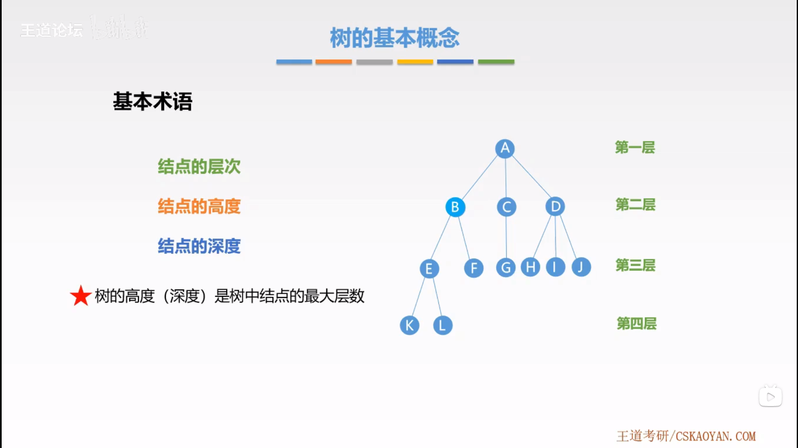

# 树与二叉树

## 1. 树的基本概念

树是 $n（n \geq 0）$ 个结点的有限集合，$n=0$ 时，称为空树。

而任意非空树应满足：

1. 有且仅有一个特定的称为**根**的结点。
2. 当 $n>0$ 时，其余结点可分为 $m（m \geq 0）$ 个互不相交的有限集合，其中每一个集合本身又是一棵树，称为根结点的**子树**。

$n$ 个结点的树中只有 $n-1$ 条边。

## 2. 基本术语

- 祖先结点和子孙结点
- 双亲结点和孩子结点
- 兄弟结点
- （结点的）度：树中一个结点的**子结点的个数**称为该结点的度。
- （树的）度：树中最大度数。
- 分支结点：度大于 $0$ 的结点。
- 叶子结点：度为 $0$ 的结点。
- 结点的层次：根结点为第一层（或第零层）。
- 结点的高度：从叶子结点（第一层）开始逐层累加。
- 结点的深度：从根结点（第一层）开始逐层累加。
- 树的高度（深度）是树中结点的最大层数。
- 有序树和无序树
- 路径：树中两个结点之间的路径是由这两个结点之间所经过的**结点序列**构成的。（树的分支是有向的，即从双亲结点指向孩子结点，所以路径一定是自上而下的。）
- 路径长度：路径上所经过**边**的个数。
- 森林：$m（m \geq 0）$ 棵互不相交的树的集合。

## 3. 树的性质

- 树中结点树等于所有结点的度加 $1$。
- 度为 $m$ 的树中第 $i$ 层上至少有 $m^{i-1}$ 个结点（$i \geq 1$）。
- 高度为 $h$ 的 $m$ 叉树至多有 $(m^h-1)/(m-1)$ 个结点。
- 具有 $n$ 个结点的 $m$ 叉树的最小高度为：$\left \lceil log_m(n(m-1)+1) \right \rceil$。

性质二说明：

- 第一层：$1=m^0$
- 第二层：$1=m^1$
- 第三层：$1=m^2$
- ...
- 第 $i$ 层：$1=m^{i-1}$

## 4. [二叉树](binary-tree/README.md#二叉树)

### 4.1. [五种基本形态](binary-tree/README.md#1-五种基本形态)

### 4.2. [二叉树 VS 度为 2 的有序树](binary-tree/README.md#2-二叉树-VS-度为-2-的有序树)

### 4.3. [特殊二叉树](binary-tree/README.md#3-特殊二叉树)

- [满二叉树](binary-tree/README.md#31-满二叉树)
- [完全二叉树](binary-tree/README.md#32-完全二叉树)
- [二叉排序树](binary-tree/README.md#33-二叉排序树)
- [平衡二叉树](binary-tree/README.md#34-平衡二叉树)

### 4.4. [二叉树的性质](binary-tree/README.md#4-二叉树的性质)

### 4.5. [二叉树的存储结构](binary-tree-storage/README.md#二叉树的存储结构)

- [二叉树的顺序存储](binary-tree-storage/README.md#1-二叉树的顺序存储)
- [二叉树的链式存储](binary-tree-storage/README.md#2-二叉树的链式存储)

### 4.6. [二叉树的遍历](binary-tree-traversal/README.md#二叉树的遍历)

- [先序遍历](binary-tree-traversal/README.md#1-先序遍历)
- [中序遍历](binary-tree-traversal/README.md#2-中序遍历)
- [后序遍历](binary-tree-traversal/README.md#3-后序遍历)
- [层次遍历](binary-tree-traversal/README.md#5-层次遍历)
- [由遍历序列构造二叉树](binary-tree-traversal/README.md#6-由遍历序列构造二叉树)

### 4.7. [线索二叉树](binary-tree-traversal/README.md#7-线索二叉树)

#### 4.7.1. [线索二叉树的概念](binary-tree-traversal/README.md#71-线索二叉树的概念)

- 先序线索二叉树
- 中序线索二叉树
- 后序线索二叉树

#### 4.7.2. [线索二叉树的构造](binary-tree-traversal/README.md#72-线索二叉树的构造)

## 5. [树的存储结构](tree-storage/README.md#树的存储结构)

- [双亲表示法](tree-storage/README.md#1-双亲表示法)
- [孩子表示法](tree-storage/README.md#2-孩子表示法)
- [孩子兄弟表示法](tree-storage/README.md#3-孩子兄弟表示法)

|                | 优点                                             | 缺点                     |
| -------------- | ------------------------------------------------ | ------------------------ |
| 双亲表示法     | 寻找结点的双亲结点效率高                         | 寻找结点的孩子结点效率低 |
| 孩子表示法     | 寻找结点的孩子结点效率高                         | 寻找结点的双亲结点效率低 |
| 孩子兄弟表示法 | 寻找结点的孩子结点效率高，方便实现树转换为二叉树 | 寻找结点的双亲结点效率低 |

## 6. [树与森林](tree-traversal/README.md#树与森林)

- [树与二叉树的转换](tree-traversal/README.md#1-树与二叉树的转换)
- [森林与二叉树的转换](tree-traversal/README.md#2-森林与二叉树的转换)

[树的遍历](tree-traversal/README.md#3-树的遍历)

- [先根遍历](tree-traversal/README.md#31-先根遍历)
- [后根遍历](tree-traversal/README.md#32-后根遍历)
- [层次遍历](tree-traversal/README.md#33-层次遍历)

[森林的遍历](tree-traversal/README.md#4-森林的遍历)

- [先序遍历](tree-traversal/README.md#41-先序遍历)
- [中序遍历](tree-traversal/README.md#42-中序遍历)

| 树       | 森林     | 二叉树   |
| -------- | -------- | -------- |
| 先根遍历 | 先序遍历 | 先序遍历 |
| 后根遍历 | 中序遍历 | 中序遍历 |

## 7. [树的应用](tree-applications/README.md)

- [并查集](tree-applications/README.md#1-并查集)
- [二叉排序树](binary-tree-applications/README.md#1-二叉排序树)
- [平衡二叉树](binary-tree-applications/README.md#2-平衡二叉树)
- [哈夫曼树和哈夫曼编码](binary-tree-applications/README.md#3-哈夫曼树)
