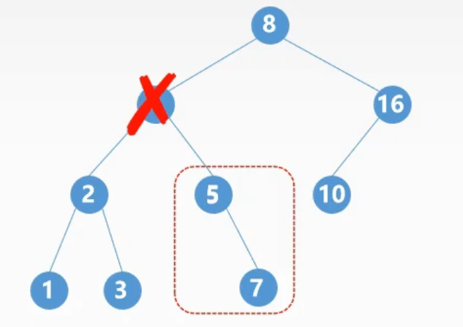
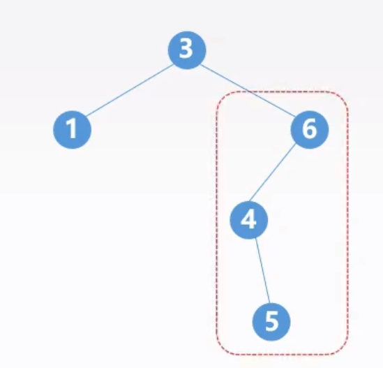

# 二叉树的应用

## 1. 二叉排序树

BST，也称二叉查找树。

二叉排序树或者为空树，或者为非空树，当为非空树时有如下特点：

- 若左子树非空，则左子树上所有结点关键字值均**小于**根结点的关键字。
- 若右子树非空，则右子树上所有结点关键字值均**大于**根结点的关键字。
- 左、右子树本身也分别是一棵二叉排序树。

$$
左子树结点值 < 根结点值 < 右子树结点值
$$

二叉排序树的**中序遍历序列**是一个递增有序序列。

### 1.1. 查找

1. 二叉树非空时，查找根结点，若相等则查找成功；
2. 若不等，则当小于根结点值时，查找左子树；当大于根结点的值时，查找右子树。
3. 当查找到叶结点仍没查找到相应的值，则查找失败。

```cpp
// T 为二叉排序树
// key 为查找的值
BSTNode *BST_Search(BiTree T, ElemType key, BSTNode *&p)
{
    p = NULL;
    while (T != NULL && key != T->data)
    {
        p = T;
        if (key < T->data)
        {
            T = T->lchild;
        }
        else
        {
            T = T->rchild;
        }
    }
    return T;
}
```

时间复杂度：$O(h)$。（$h$ 为二叉排序树的高度）

### 1.2. 插入

1. 若二叉排序树为空，则直接插入结点；
2. 若二叉排序树非空，
   1. 当值小于根结点时，插入左子树；
   2. 当值大于根结点时，插入右子树；
   3. 当值等于根结点时，不进行插入。

```cpp
int BST_Insert(BiTree &T, keyType k)
{
    if (T == NULL)
    {
        T = (BiTree)malloc(sizeof(BSTNode));
        T->key = k;
        T.lchild = T.rchild = NULL;
        return 1;
    }
    else if (k == T->key)
    {
        return 0;
    }
    else if (k < T->key)
    {
        BST_Insert(T.lchild, k);
    }
    else
    {
        BST_Insert(T.rchild, k);
    }
}
```

### 1.3. 构造二叉排序树

1. 读入一个元素并建立结点，若二叉树为空将其作为根结点；
2. 若二叉排序树非空，
   1. 当值小于根结点时，插入左子树；
   2. 当值大于根结点时，插入右子树；
   3. 当值等于根结点时，不进行插入。

```cpp
void Create_BST(BiTree &T, KetType str[], int n)
{
    T = NULL;
    int i = 0;
    while (i < n)
    {
        BST_Insert(T, str[i]);
        i++;
    }
}
```

### 1.4. 删除

- 若被删除结点 $z$ 是叶子结点，则直接删除；
- 若被删除结点 $z$ 只有一棵子树，则让 $z$ 的子树成为 $z$ 父结点的子树，代替 $z$ 结点。
- 若被删除结点 $z$ 有两棵子树，则让 $z$ 的中序序列直接后继代替 $z$，并删去直接后继结点。



在二叉排序树中删除并插入某结点，得到的二叉排序树是否与原来相同？（可能相同，也可能不同）

### 1.5. 查找效率

平均查找长度（ASL）取决于树的高度。


## 2. 平衡二叉树

AVL，任意结点的**平衡因子**的绝对值不超过 $1$。

$$
平衡因子=左子树高度-右子树高度
$$


高度为 $h$ 的最小平衡二叉树的结点数 $N_h$。

$$
N_h=N_{h-1}+N_{h-2}+1
$$

$$
N_0=0
$$

$$
N_1=1
$$

### 2.1. 平衡二叉树的判断

利用递归的后序遍历过程：

1. 判断左子树是一棵平衡二叉树；
2. 判断右子树是一棵平衡二叉树；
3. 判断以该结点为根的二叉树为平衡二叉树。

判断条件：

- 若左子树和右子树均为平衡二叉树；
- 且左子树与右子树高度差的绝对值小于等于 $1$；
- 则平衡。


- $b$ 表示该结点的平衡性。
- $h$ 表示该结点的高度。

```cpp
void Judge_AVL(BiTree bt, int &balance, int &h)
{
    int bl = 0, br = 0, hl = 0, hr = 0;
    if (bt == NULL)
    {
        h = 0;
        balance = 1;
    }
    else if (bt->lchild == NULL && bt->rchild == NULL)
    {
        h = 1;
        balance = 1;
    }
    else
    {
        Judge_AVL(bt->lchild, bl, hl);
        Judge_AVL(bt->rchild, br, hr);
        if (hl > hr)
        {
            h = hl + 1;
        }
        else
        {
            h = hr + 1;
        }
        if (abs(hl - hr) < 2 && bl == 1 && br == 1)
        {
            balance = 1;
        }
        else
        {
            balance = 0;
        }
    }
}
```

### 2.2. 平衡二叉树的插入

先插入，后调整。**每次调整最小不平衡子树。**



#### 2.2.1. LL 平衡旋转


#### 2.2.2. RR 平衡旋转


#### 2.2.3. LR 平衡旋转


#### 2.2.4. RL 平衡旋转


## 3. 哈夫曼树

带权路径长度。

- 路径长度：路径上所经理**边**的个数。
- 结点的权：结点被赋予的数值。

树的带权路径长度，WPL，树中所有**叶结点**的带权路径长度之和，记为：

$$
WPL=\sum_{i=0}^nw_il_i
$$


哈夫曼树，也称最优二叉树，含有 $n$ 个带权叶子结点带权路径长度最小的二叉树。

### 3.1. 构造算法

1. 将 $n$ 个结点作为 $n$ 棵仅含有一个根结点的二叉树，构成森林 $F$；
2. 生成一个新结点，并从 $F$ 中找出根结点权值最小的两棵树作为它的左右子树，且新结点的权值为两棵子树根结点的权值之和；
3. 从 $F$ 中删除这两个树，并将新生成的树加入到 $F$ 中；
4. 重复 2、3 步骤，直到 $F$ 中只有一棵树为止。


### 3.2. 性质

- 每个初始结点都会成为叶结点，双支结点都为新生成的结点。
- 权值越大离根结点越近，反之权值越小离根结点越远。
- 哈夫曼树中没有结点的度为 $1$。
- $n$ 个叶子结点的哈夫曼树的结点总数为 $2n-1$，其中度为 $2$ 的结点数为 $n-1$。

### 3.3. 编码问题


