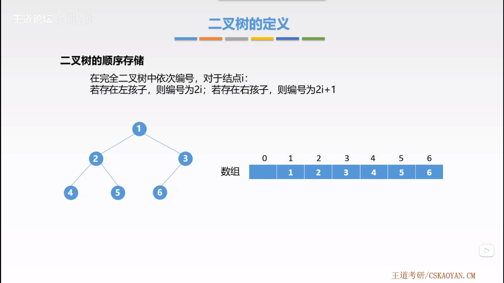
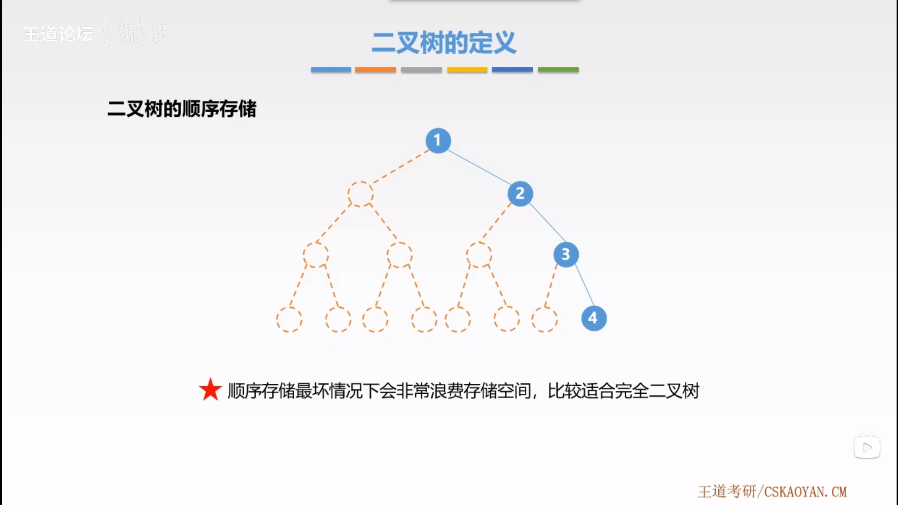
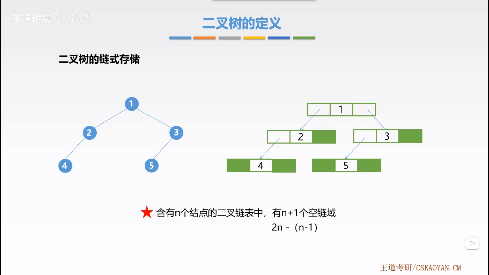

# 二叉树的存储结构

## 1. 二叉树的顺序存储

用一组连续的存储单元依次从上而下、从左至右存储[完全二叉树](../binary-tree/README.md#32-完全二叉树)上的结点元素。



在完全二叉树中依次编号，对于结点 $i$：

- 若存在左孩子，则编号为 $2i$；
- 若存在右孩子，则编号为 $2i+1$；



## 2. 二叉树的链式存储

用链表存放一棵二叉树，二叉树的每个结点用链表的一个链结点来存储。

```cpp
typedef struct BiTNode
{
    ElemType data;
    struct BiTNode *Lchild, *rclild;
} BiTNode, *BiTree;
```

含有 $n$ 个结点的二叉链表中，有 $n+1$ 个空链域。


