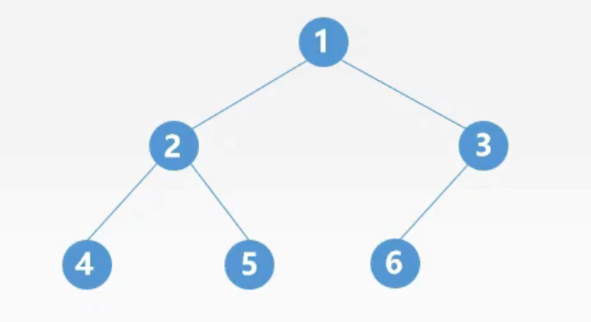
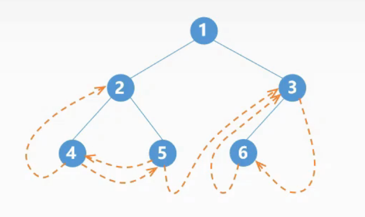
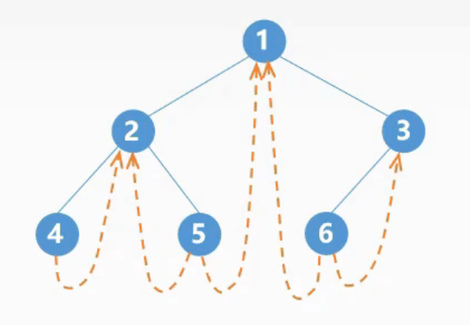
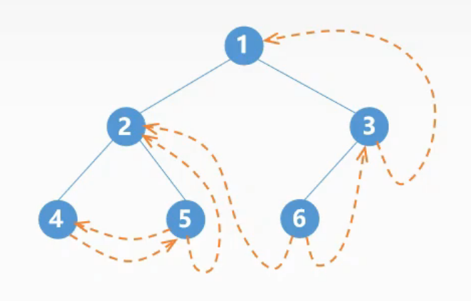
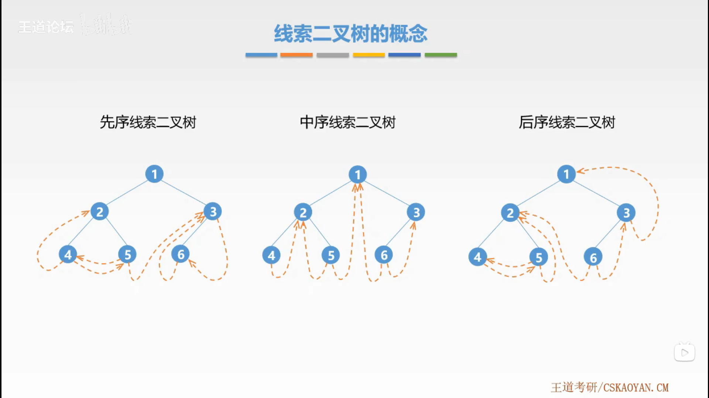
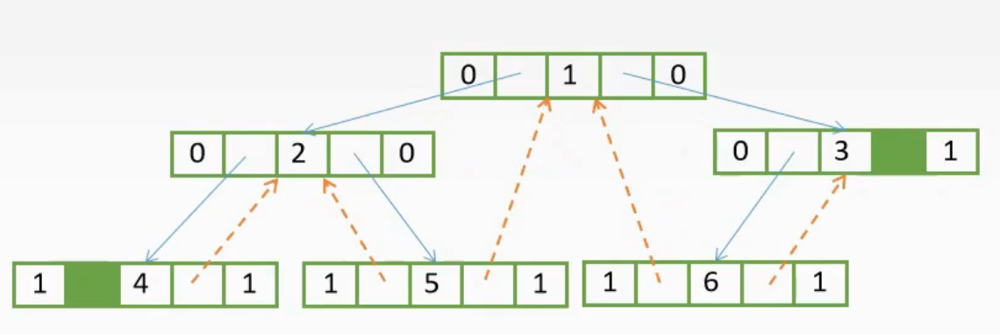
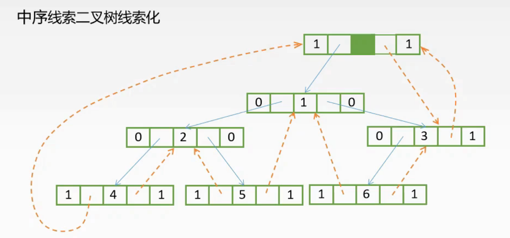

# 二叉树的遍历

按照某条搜索路径访问树中的每个结点，树的每个结点均被访问一次，而且只访问一次。

## 1. 先序遍历

若二叉树非空：

1. 访问根结点。
2. 先序遍历左子树。
3. 先序遍历右子树。

```cpp
void PreOrder(BiTree T)
{
    if (T != NULL)
    {
        visit(T);
        PreOrder(T.lchild);
        PreOrder(T.rchild);
    }
}
```

时间复杂度：$O(n)$。

## 2. 中序遍历

若二叉树非空：

1. 中序遍历左子树。
2. 访问根结点。
3. 中序遍历右子树。

```cpp
void InOrder(BiTree T)
{
    if (T != NULL)
    {
        InOrder(T.lchild);
        visit(T);
        InOrder(T.rchild);
    }
}
```

时间复杂度：$O(n)$。

## 3. 后序遍历

若二叉树非空：

1. 后序遍历左子树。
2. 后序遍历右子树。
3. 访问根结点。

```cpp
void PostOrder(BiTree T)
{
    if (T != NULL)
    {
        PostOrder(T.lchild);
        PostOrder(T.rchild);
        visit(T);
    }
}
```

时间复杂度：$O(n)$。

## 4. 中序遍历非递归算法

借助**栈**。算法思想：

1. 初始时依次扫描根结点的所有左侧结点并将他们一一进栈；
2. 出栈一个结点，**访问**它；
3. 扫描该结点的右孩子结点并将其进栈；
4. 依次扫描右孩子结点的所有左侧结点，并一一进栈；
5. 反复该过程直到栈空为止。

```cpp
void InOrder2(BiTree T)
{
    InitStack(S);
    BiTree p = T;
    while (p || IsEmpty(S))
    {
        if (p)
        {
            Push(S, p);
            p = p.lchild;
        }
        else
        {
            Pop(S, p);
            visit(p);
            p = p.rchild;
        }
    }
}
```

## 5. 层次遍历

借助**队列**。算法思想：

1. 初始将根入队并访问根结点；
2. 若有左子树，则将左子树的根入队；
3. 若有右子树，则将右子树的根入队；
4. 然后出队，访问该结点；
5. 反复该过程直到队空为止。

```cpp
void levelOrder(BiTree T)
{
    InitQueue(Q);
    BiTree p;
    EnQueue(Q, T);
    while (!isEmpty(Q))
    {
        DeQueue(Q, p);
        visit(p);
        if (p->lchild != NULL)
        {
            EnQueue(Q, p->lchild);
        }
        if (p->rchild != NULL)
        {
            EnQueue(Q, p->rchild);
        }
    }
}
```

## 6. 由遍历序列构造二叉树

- 先序（或后序）遍历序列+中序遍历序列可以确定一棵二叉树。
- 而先序遍历序列+后序遍历序列不可以确定一颗二叉树。

1. 在先序序列中，第一个结点是根结点；
2. 根结点将中序遍历序列划分为两部分；
3. 然后在先序序列中确定两部分的结点，并且两部分的第一个结点分别为左子树的根结点和右子树的根结点；
4. 在子树中递归重复该过程，边能唯一确定一棵二叉树。

> 层次遍历序列+中序遍历序列也可以确定一棵二叉树。

## 7. 线索二叉树

### 7.1. 线索二叉树的概念

线索化：

1. 若无左子树，则将左指针指向其前驱结点；
2. 若无右子树，则将右指针指向其后继结点。



- 先序遍历：$124536$



- 中序遍历：$425163$



- 后序遍历：$452631$



线索二叉树的结点结构

| ltag | lchild | data | rclild | rtag |
| ---- | ------ | ---- | ------ | ---- |

$$
标志域l(r)tag=
\begin{cases}
  0,l(r)child域指示结点的左（右）孩子\\
  1,l(r)child域指示结点的前驱（后继）
\end{cases}
$$

```cpp
typedef struct ThreadNode
{
    ElemType data;
    struct ThreadNode *lchild, *rclild;
    int ltag, rtag;
}ThreadNode, *ThreadTree;
```

这种结点结构构成的二叉链表作为二叉树的存储结构，称为**线索链表**。



### 7.2. 线索二叉树的构造

常用的是**中序线索二叉树**。

寻找前驱结点：

- 若左指针为线索，则其指向结点为前驱结点。
- 若左指针为左孩子，则其左子树的最右侧结点为前驱结点。

寻找后继结点：

- 若右指针为线索，则其指向结点为后继结点。
- 若右指针为右孩子，则其右子树的最左侧结点为后继结点。

中序线索二叉树线索化

```cpp
// p 为线索二叉树的根结点
// pre 为对应结点的前驱结点
void InThread(ThreadTree &p, ThreadTree &pre)
{
    if (p != NULL)
    {
        InThread(p->lchild, pre);
        if (p->lchild == NULL)
        {
            p->lchild = pre;
            p->ltag = 1;
        }
        if (pre != NULL && pre->lchild == NULL)
        {
            p->rchild = p;
            p->rtag = 1;
        }
        InThread(p->rchild, pre);
    }
}
```

```cpp
void CreateInThread(ThreadTree T)
{
    ThreadTree pre = NULL;
    if (T != NULL)
    {
        InThread(T, pre);
        pre->rchild = NULL;
        pre->rtag = 1;
    }
}
```





```cpp
// p 为线索二叉树的根结点
ThreadNode *FirstNode(ThreadNode *p)
{
    while (p->ltag == 0)
    {
        p = p->lchild;
    }
    return p;
}
```

```cpp
// p 为结点
ThreadNode *NextNode(ThreadNode *p)
{
    if (p->rtag == 0)
    {
        return FirstNode(p.rchild); // 如果有孩子结点，则后继结点就是右子树最左侧的结点
    }
    else
    {
        return p.rchild;
    }
}
```

```cpp
// 遍历
void InOrder(ThreadNode *T)
{
    for (ThreadNode *p = FirstNode(T); p != NULL; p = NextNode(p))
    {
        visit(p);
    }
}
```
