# 二叉树

二叉树是 $n（n \geq 0）$ 个结点的有限集合。

1. $n=0$ 时，二叉树为空。
2. $n>0$ 时，由根节点和两个互不相交的被称为根的左子树和右子树组成。左子树和右子树也分别是一棵二叉树。

## 1. 五种基本形态

- 空树
- 仅有根结点
- 根节点+左子树
- 根节点+右子树
- 根节点+左子树+右子树

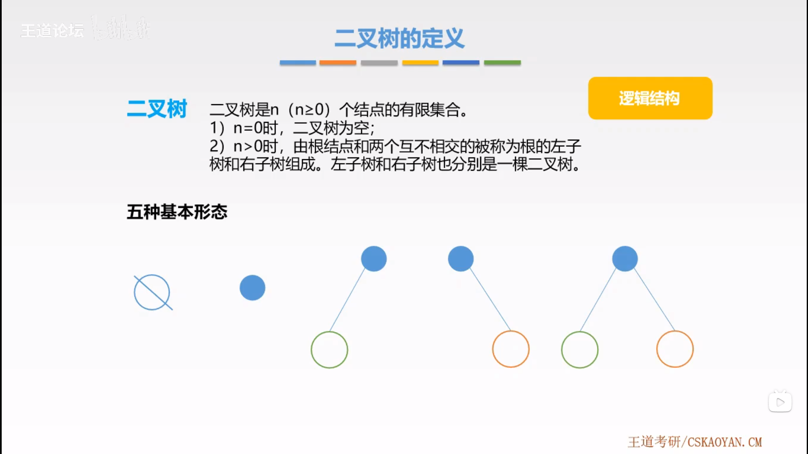

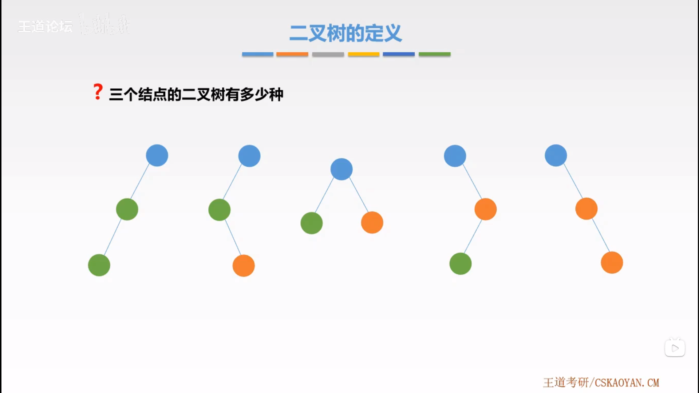

## 2. 二叉树 VS 度为 2 的有序树

- 二叉树可以为空，而度为 2 的有序树至少有三个结点。
- 二叉树的孩子结点始终有左右之分，而度为 2 的有序树孩子结点的次序是相对的。

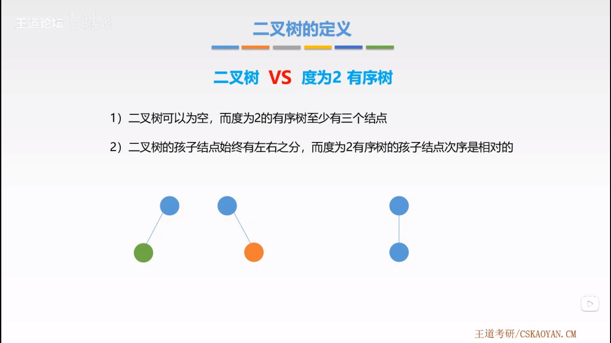

## 3. 特殊二叉树

### 3.1. 满二叉树

一颗高度为 $h$，且含有 $2^h-1$ 个结点的二叉树称为满二叉树。（高度为 $h$ 的 $m$ 叉树至多有 $(m^h-1)/(m-1)$ 个结点。）

对于编号为 $i$ 的结点，若存在，其双亲结点的编号为：$\left \lfloor i/2 \right \rfloor$，左孩子编号为：$2i$，右孩子编号为：$2i+1$。

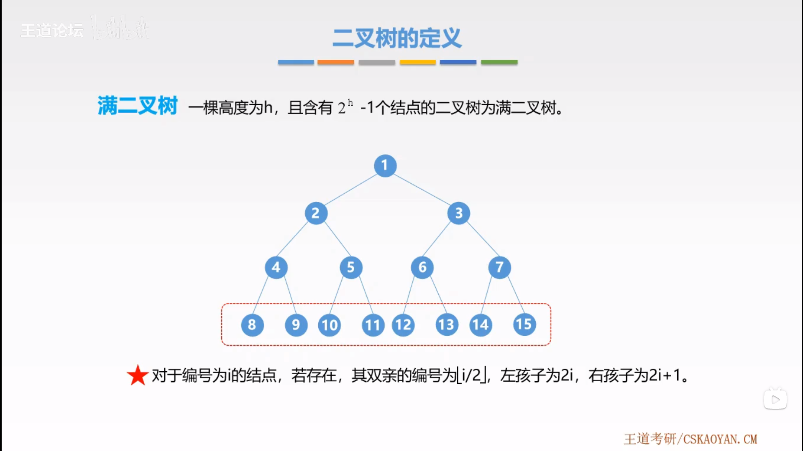

### 3.2. 完全二叉树

设一个高度为 $h$、有 $n$ 个结点的二叉树，当且仅当每个结点都与高度为 $h$ 的满二叉树中编号 $1 \sim n$ 的结点一一对应时，称为完全二叉树。

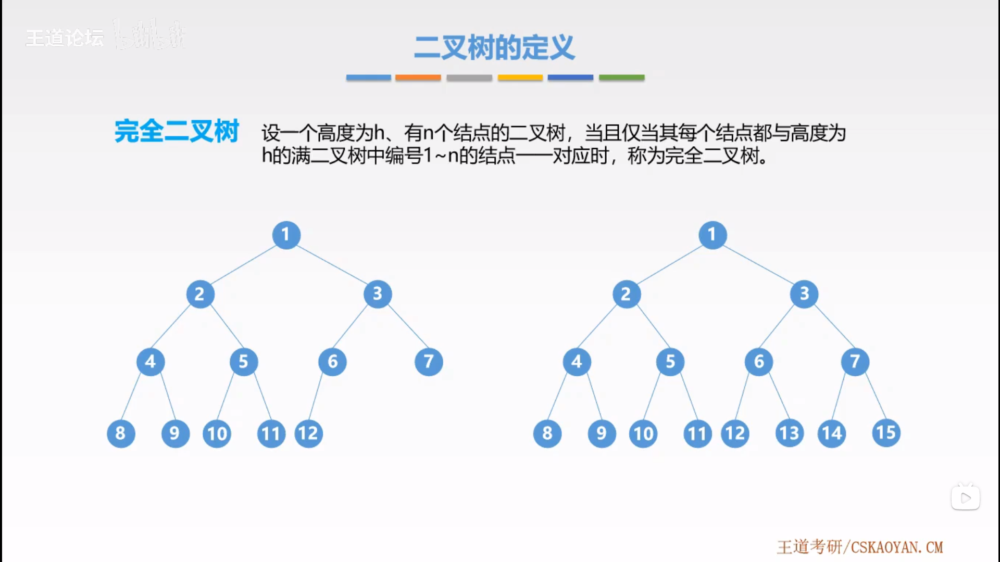

- 若 $i<[n/2]$，则结点 $i$ 为分支结点，否则为叶子结点。
- 叶子结点只可能出现在层次最大的两层上出现。对于最大层次的叶子结点，都依次排在最左边的位置上。
- 度为 $1$ 的结点若存在，则可能有一个，且是编号最大的分支结点，并孩子结点一定是左节点。

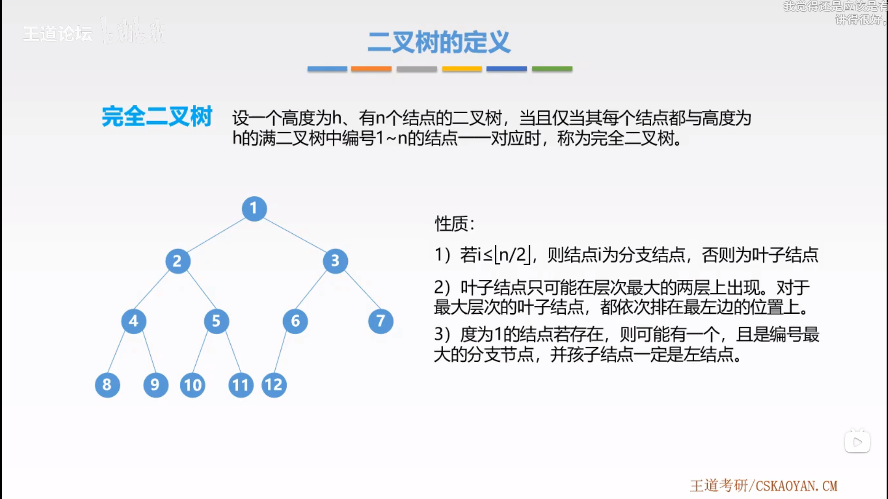

### 3.3. 二叉排序树

一颗二叉树，若树非空，则有如下性质：

对任意结点若存在左子树或右子树，则其左子树上所有结点的关键字均小于该节点。右子树上所有结点的关键字均大于该结点。

### 3.4. 平衡二叉树

树上**任意结点**的左子树和右子树的深度之差不超过 $1$。

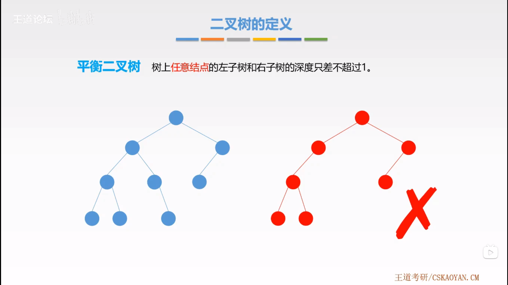

## 4. 二叉树的性质

- 非空二叉树上的叶子结点数等于度为 $2$ 的节点数加 $1$，即 $n_0=n_2+1$

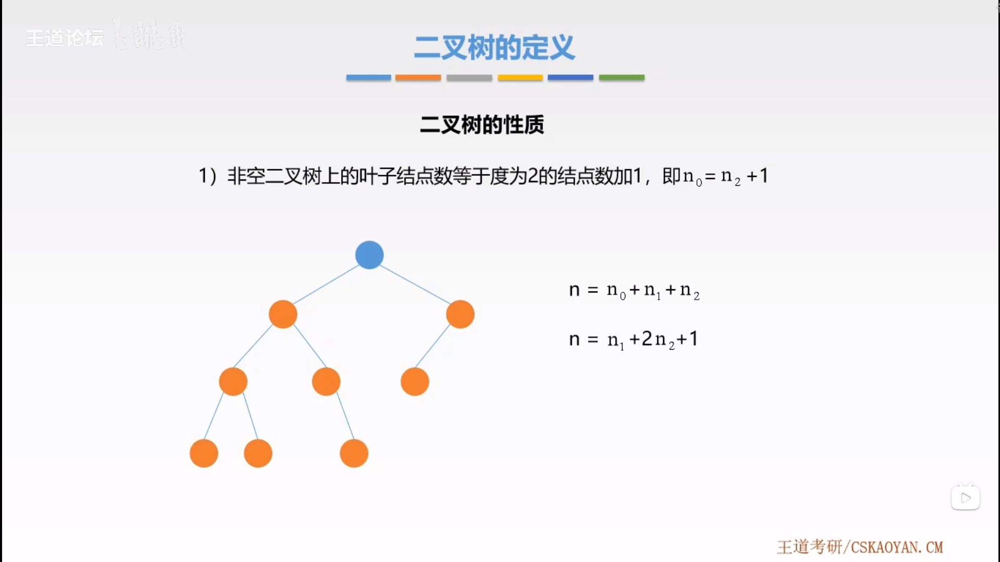

- 非空二叉树上第 $k$ 层上至多有 $2^{k-1}$ 个结点（$k \geq 1$）。
- 高度为 $h$ 的二叉树至多有 $2^h-1$ 个结点（$h \geq 1$）。

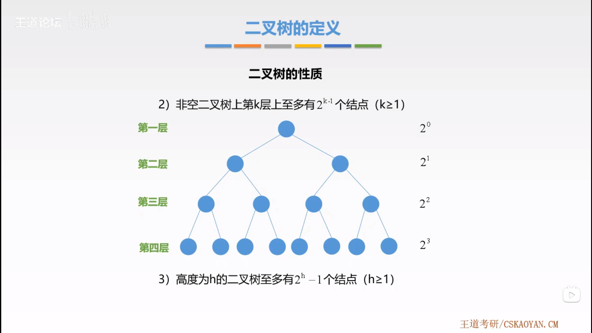

- 对完全二叉树按从上到下、从左到右的顺序依次编号 $1,2,...,n$，则有以下关系：
  - 当 $i>1$ 时，结点 $i$ 的双亲节点编号为：$\left \lfloor i/2 \right \rfloor$。即当 $i$ 为偶数时，其双亲结点的编号为 $i/2$，它是双亲结点的左孩子 0；当 $i$ 为奇数时，其双亲结点的编号的为 $(i-1)/2$，它是双亲结点的右孩子。
  - 当 $2i \leq n$ 时，结点 $i$ 的左孩子编号为 $2i$，否则无左孩子。
  - 当 $2i+1 \leq n$ 时，结点 $i$ 的右孩子编号为 $2i+1$，否则无右孩子。
  - 结点 $i$ 所在的层次为 $\left \lfloor log_2i \right \rfloor+1$。

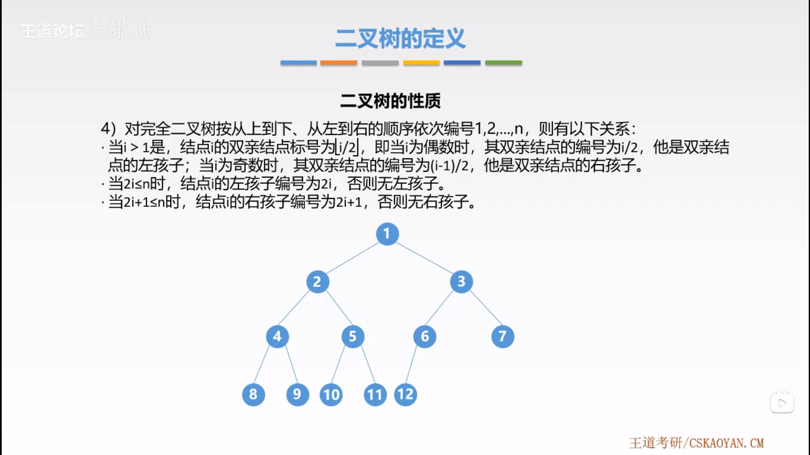

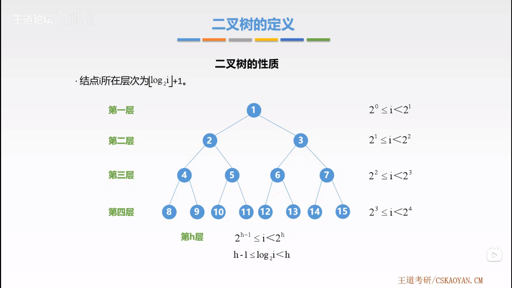

- 具有 $n$ 个（$n>0$）结点的完全二叉树的高度为 $\left \lfloor log_2n+1 \right \rfloor$ 或 $\left \lceil log_2(n+1) \right \rceil$。

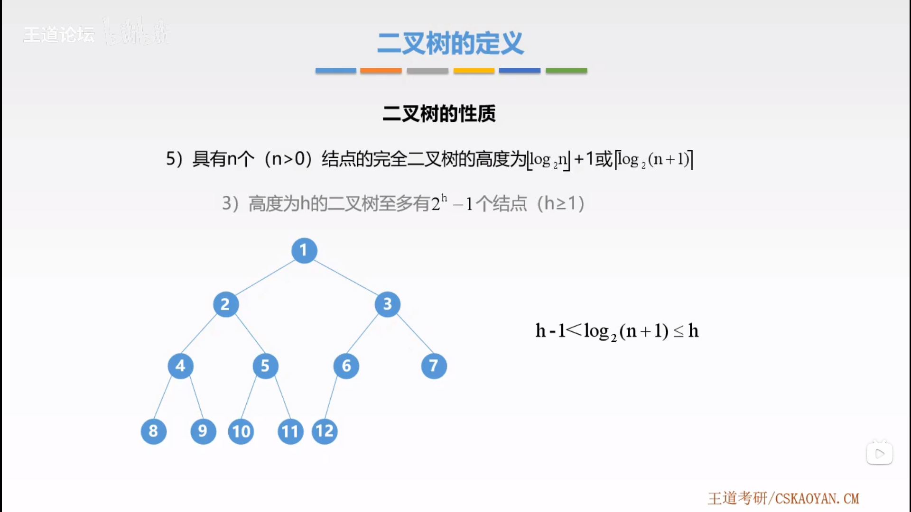
