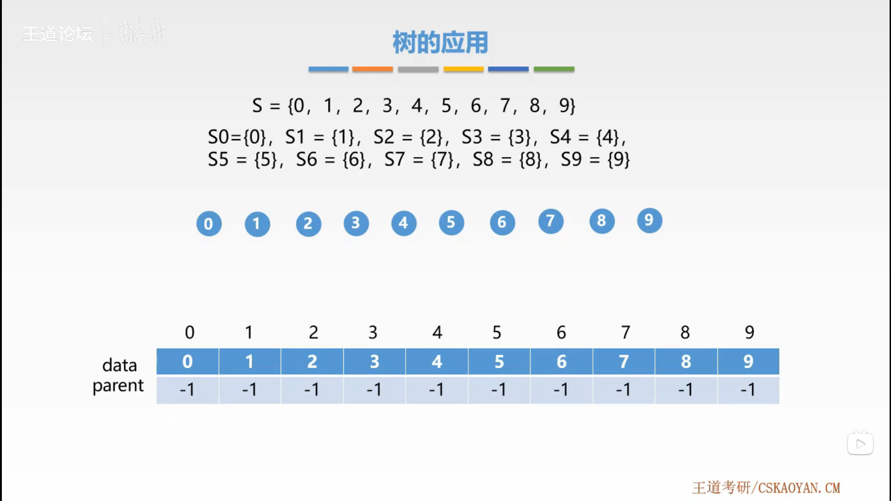
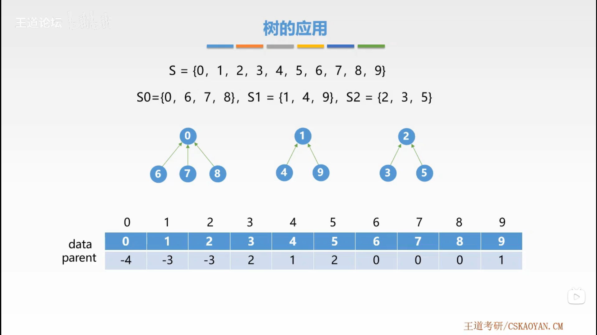
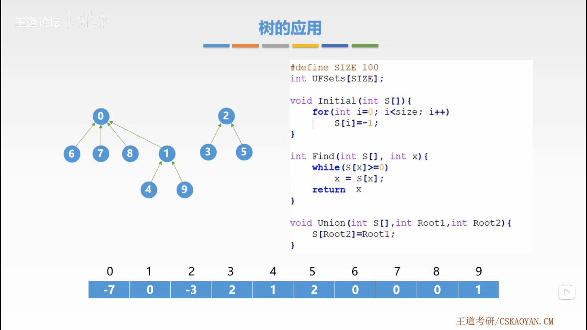

# 树的应用

## 1. 并查集

一种简单的集合表示。

通常用树的双亲表示法作为并查集的存储结构。

通常用数组元素的下标代表元素名，用根结点的下标代表子集合名，根结点的双亲结点为负数。

- `Initial(S)`：将集合 $S$ 的每个元素都初始化为只有一个单元素的子集合。
- `Union(S, Root1, Root2)`：将集合 $S$ 的子集合（互不相交） $Root2$ 并入到子集合 $Root1$。
- `Find(S, x)`：查找集合 $S$ 中单元素 $x$ 所在的子集合，并返回该子集合的名字。





```cpp
#define SIZE 100
void Initial(int S[])
{
    for (int i = 0; i < size; i++)
    {
        S[i] = -1;
    }
}
```

```cpp
int Find(int S[], int x)
{
    while (S[x] >= 0)
    {
        x = S[x];
    }
    return x;
}
```

```cpp
void Union(int S[], int Root1, int Root2)
{
    S[Root2] = Root1;
}
```


