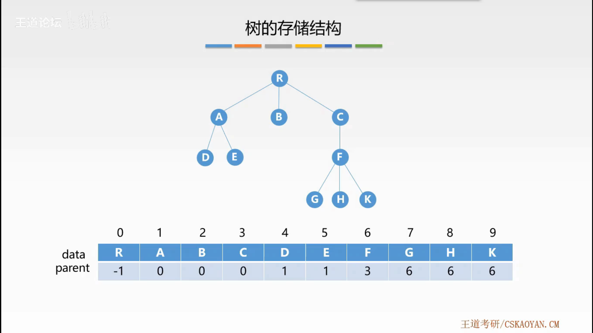
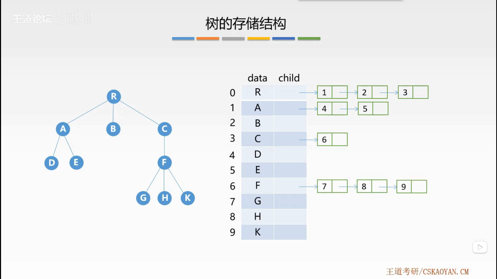
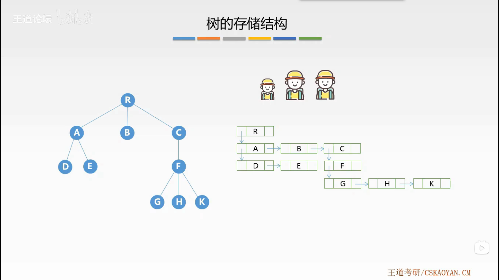

# 树的存储结构

## 1. 双亲表示法

采用一组连续的存储空间来存储每个结点，同时在每个结点中增设一个伪指针，指示双亲结点在数组的位置。

根结点的下标为 $0$，其伪指针域为 $-1$。

```cpp
#define MAX_TREE_SIZE 100
typedef struct
{
    ElemType data;
    int parent;
} PTNode;
typedef struct
{
    PTNode nodes[MAX_TREE_SIZE];
    int n;
} PTree;
```



## 2. 孩子表示法

将每个结点的孩子结点都用单链表链接起来形成一个线性结构，$n$ 个结点具有 $n$ 个孩子链表。

```cpp
#define MAX_TREE_SIZE 100
typedef struct
{
    int child;
    struct CNode *next;
} CNode;
typedef struct
{
    ElemType data;
    struct CNode *child;
} PNode;
typedef struct
{
    PNode nodes[MAX_TREE_SIZE];
    int n;
} CTree;
```



## 3. 孩子兄弟表示法

以二叉链表作为树的存储结构，又称二叉树表示法。（左孩子右兄弟）

```cpp
typedef struct CSNode
{
    ElemType data;
    struct CSNode *firstchild, *nextsibling;
} CSNode, CSTree;
```


