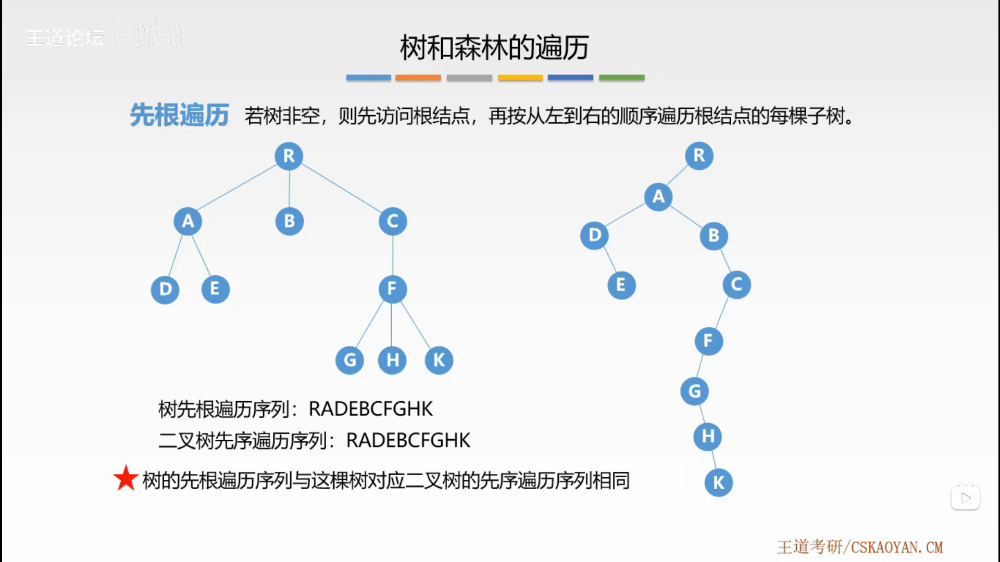
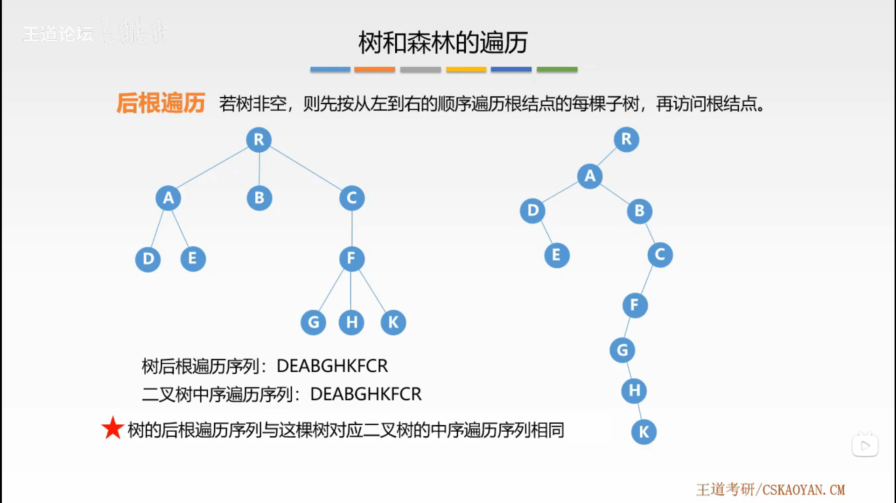
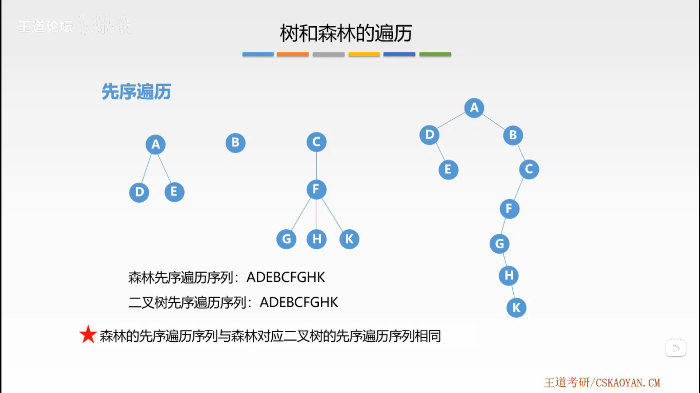
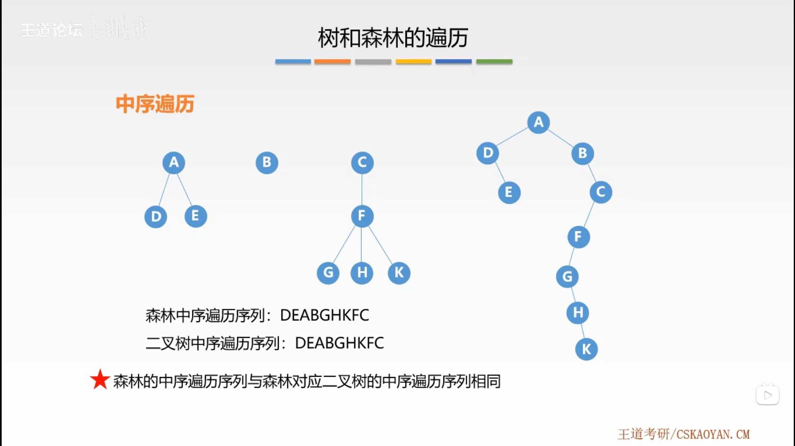

# 树与森林

## 1. 树与二叉树的转换

- 树转二叉树：每个结点左指针指向它的第一个孩子结点，右指针指向它在树中相邻兄弟结点。
- 二叉树转树：每个结点都指向他们的双亲结点。

## 2. 森林与二叉树的转换

- 森林转二叉树：将每一棵树转换为二叉树，将每棵二叉树的根依次作为上一棵二叉树的右子树。
- 二叉树转森林

## 3. 树的遍历

按照某种方式访问树中的每个结点，且仅访问一次。

### 3.1. 先根遍历

若树非空，则先访问根结点，再按从左到右的顺序遍历根结点的每棵子树。

**树的先根遍历序列与这棵树的对应二叉树的先序遍历序列相同。**

### 3.2. 后根遍历

若树非空，则先按从左到右的顺序遍历根结点的每棵子树，再访问根结点，

**树的后根遍历序列与这棵树的对应二叉树的中序遍历序列相同。**

### 3.3. 层次遍历

## 4. 森林的遍历

### 4.1. 先序遍历

若森林非空，则，

- 访问森林中第一棵树的根结点
- 先序遍历第一棵树的子树森林
- 先序遍历除去第一棵树之后剩余的树构成的子树森林

**森林的先序遍历序列与森林对应二叉树的先序遍历序列相同。**

### 4.2. 中序遍历

若森林非空，则，

- 中序遍历第一棵树的根结点的子树森林
- 访问第一棵树的根结点
- 中序遍历除去第一棵树之后剩余的树构成的子树森林

**森林的中序遍历序列与森林对应二叉树的中序遍历序列相同。**

