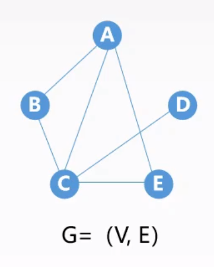

# 图

## 1. [基本概念](concept/README.md#图的基本概念)

图 $G$ 是由顶点集 $V$ 和边集 $E$ 组成，记为：

$$
G=(V,E)
$$

其中，

- $V(G)$ 表示图 $G$ 中顶点的有限非空集；
- $E(G)$ 表示图 $G$ 中顶点之间的关系（边）的集合。

$\left \vert V \right \vert$ 表示图 $G$ 中顶点的个数，也称图 $G$ 的阶。

$\left \vert E \right \vert$ 表示图 $G$ 中边的条数。

$$
V=\{A,B,C,D,E\},\left \vert V \right \vert=5
$$

$$
E=\{(A,B),(A,C),(A,E),(B,C),(C,D),(C,E)\},\left \vert E \right \vert=6
$$

线性表、树都可以为空，但图不能为空。

- [无向图 & 有向图](concept/README.md#1-无向图-&-有向图)
- [简单图 & 多重图](concept/README.md#2-简单图-&-多重图)
- [完全图](concept/README.md#3-完全图)
- [子图](concept/README.md#4-子图)
- [连通 & 强连通](concept/README.md#5-连通-&-强连通)
- [连通图 & 强连通图](concept/README.md#6-连通图-&-强连通图)
- [连通分量 & 强连通分量](concept/README.md#7-连通分量-&-强连通分量)
- [极小连通子图](concept/README.md#8-极小连通子图)
- [生成树、生成森林](concept/README.md#9-生成树、生成森林)
- [顶点的度](concept/README.md#10-顶点的度)
- [网](concept/README.md#11-网)
- [稠密图 & 稀疏图](concept/README.md#12-稠密图-&-稀疏图)
- [有向树](concept/README.md#13-有向树)
- [路径](concept/README.md#14-路径)
- [路径长度](concept/README.md#15-路径长度)
- [回路](concept/README.md#16-回路)

## 2. [存储结构](storage/README.md#图的存储结构)

- [邻接矩阵](storage/README.md#1-邻接矩阵法)
- [邻接表](storage/README.md#2-邻接表法)
- [十字链表](storage/README.md#3-十字链表)
- [邻接多重表](storage/README.md#4-邻接多重表)

## 3. [基本操作](operation/README.md#图的基本操作)

- [边是否存在](operation/README.md#1-边是否存在)
- [顶点的邻接边](operation/README.md#2-顶点的邻接边)
- [插入顶点](operation/README.md#3-插入顶点)
- [删除顶点](operation/README.md#4-删除顶点)
- [增加边](operation/README.md#5-增加边)
- [删除边](operation/README.md#6-删除边)
- [第一条边和下一条边](operation/README.md#7-第一条边和下一条边)
- [获取权值和设置权值](operation/README.md#8-获取权值和设置权值)

## 4. [遍历](traversal/README.md#图的遍历)

- [广度优先搜索](traversal/README.md#1-广度优先搜索)
- [深度优先搜索](traversal/README.md#2-深度优先搜索)
- [遍历与连通性问题](traversal/README.md#3-遍历与连通性问题)

## 5. [应用](applications/README.md#图的应用)

- [最小生成树](applications/README.md#1-最小生成树)
- [最短路径](applications/README.md#2-最短路径)
- [拓扑排序](applications/README.md#3-拓扑排序)
- [关键路径](applications/README.md#4-关键路径)
