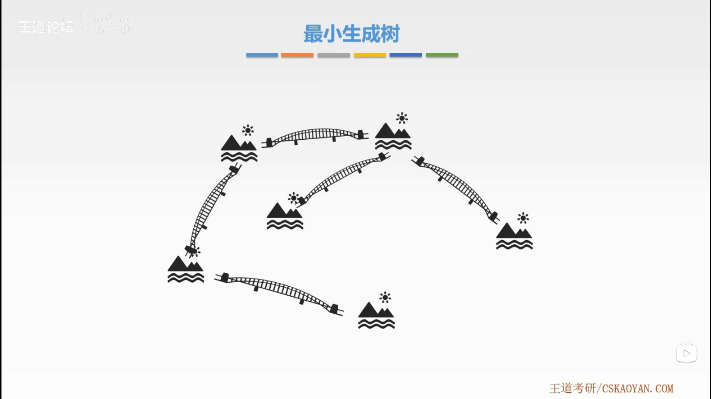

# 图的应用

## 1. 最小生成树

### 1.1. 概念

### 1.2. 性质

- 所有边的情况皆不相同。

- $n$ 个顶点只有 $n-1$ 条边。

### 1.3. 算法

- 不会产生回路
- 权值最小

都使用贪心算法策略。

> 考研中多考查算法步骤；代码编写考查较少。

#### 1.3.1. Prim

#### 1.3.2. Kruskal

## 2. 最短路径

> 考研中多考查算法步骤；代码编写考查较少。

### 2.1. Dijkstra

### 2.2. Floyd

## 3. 拓扑排序

### 3.1. 概念

### 3.2. 算法思想

## 4. 关键路径

- 事件最早发生时间：等待所有前置事件都完成。

- 事件最迟发生时间：不延期后置事件的发生。

- 活动最早开始时间。

- 活动最迟开始时间。

- 差额。

