# 图的基本概念

## 1. 无向图 & 有向图

## 2. 简单图 & 多重图

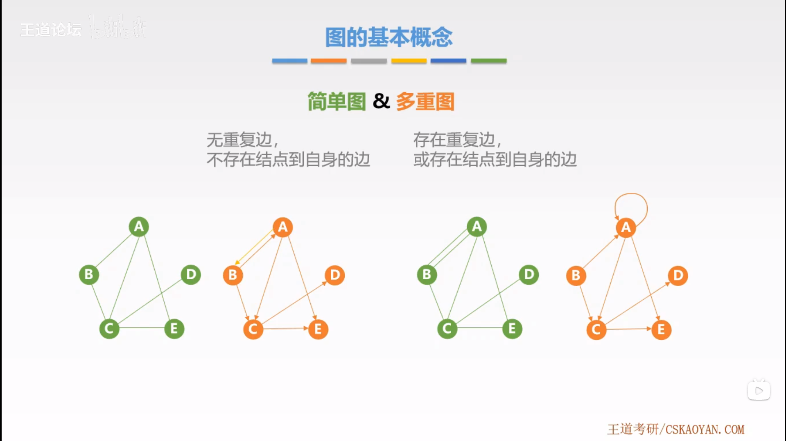

## 3. 完全图

- 无向完全图
- 有向完全图

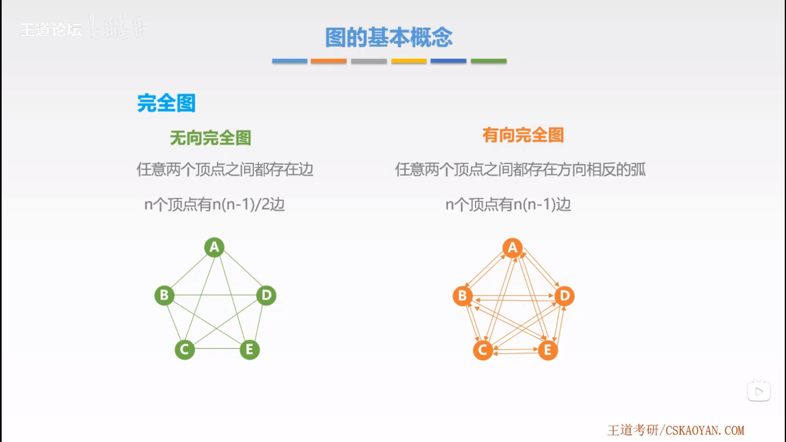

## 4. 子图

- 与原图相同也成为子图。
- 只有顶点也是子图

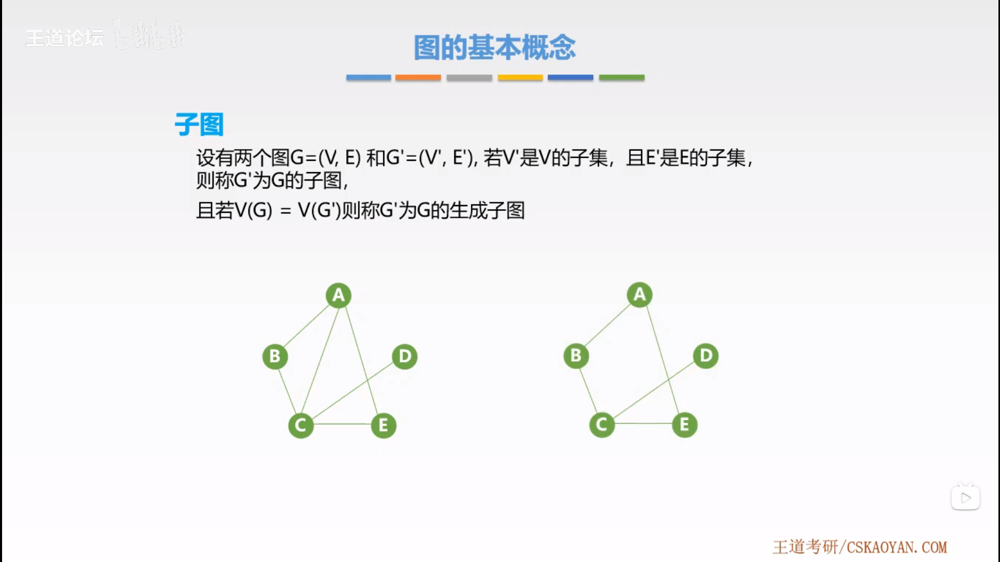

## 5. 连通 & 强连通

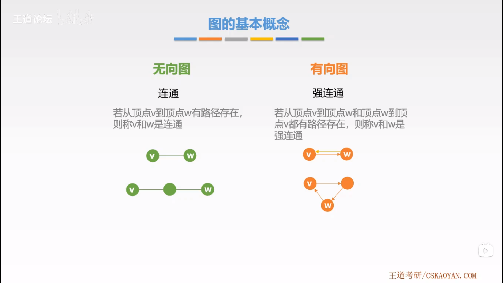

## 6. 连通图 & 强连通图

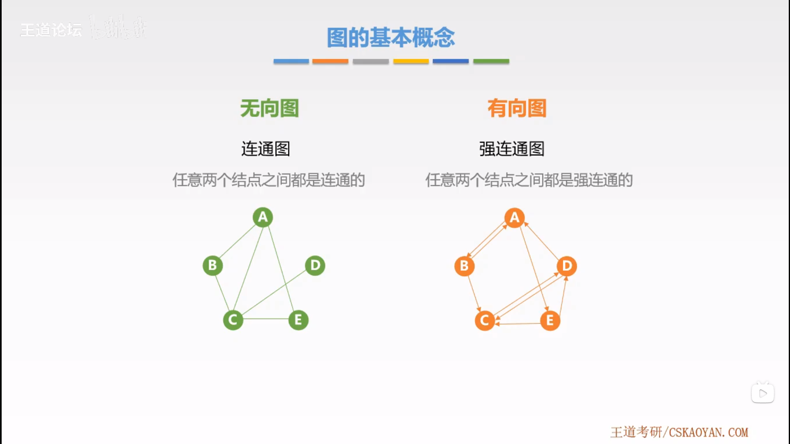

## 7. 连通分量 & 强连通分量

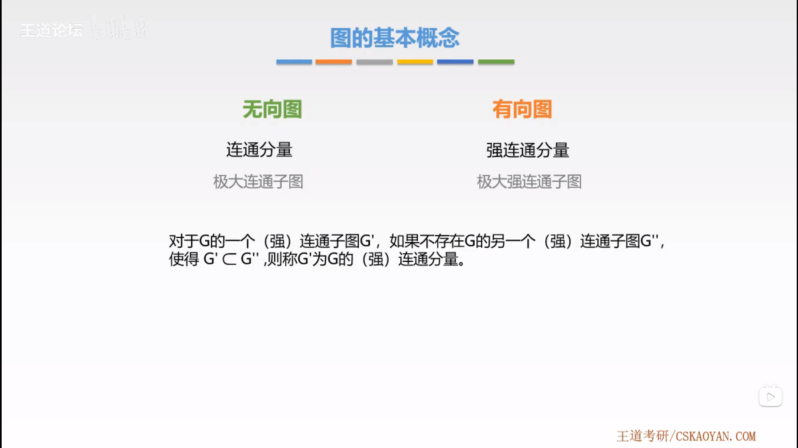

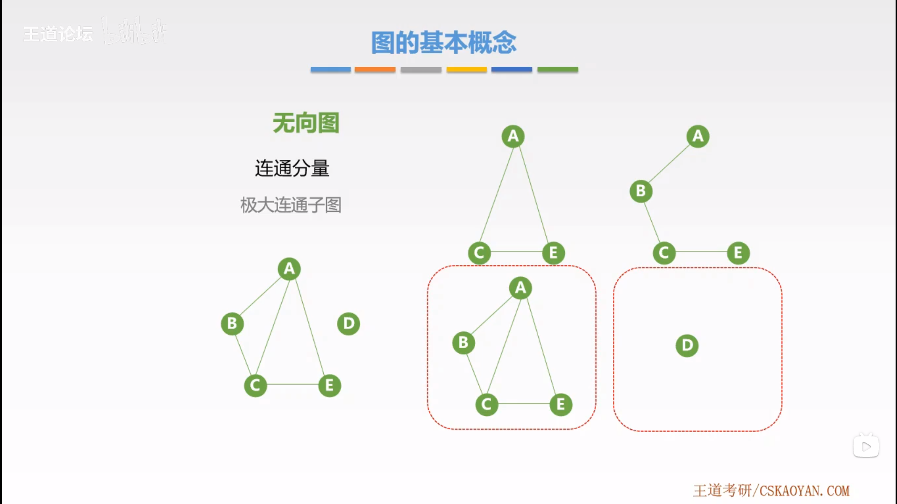

## 8. 极小连通子图

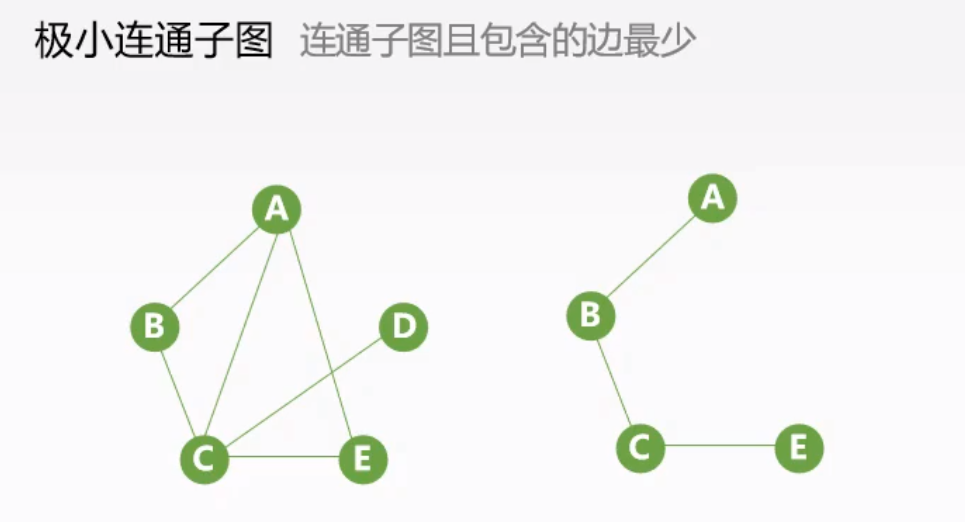

## 9. 生成树、生成森林

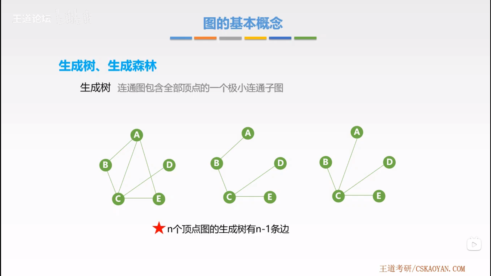

## 10. 顶点的度

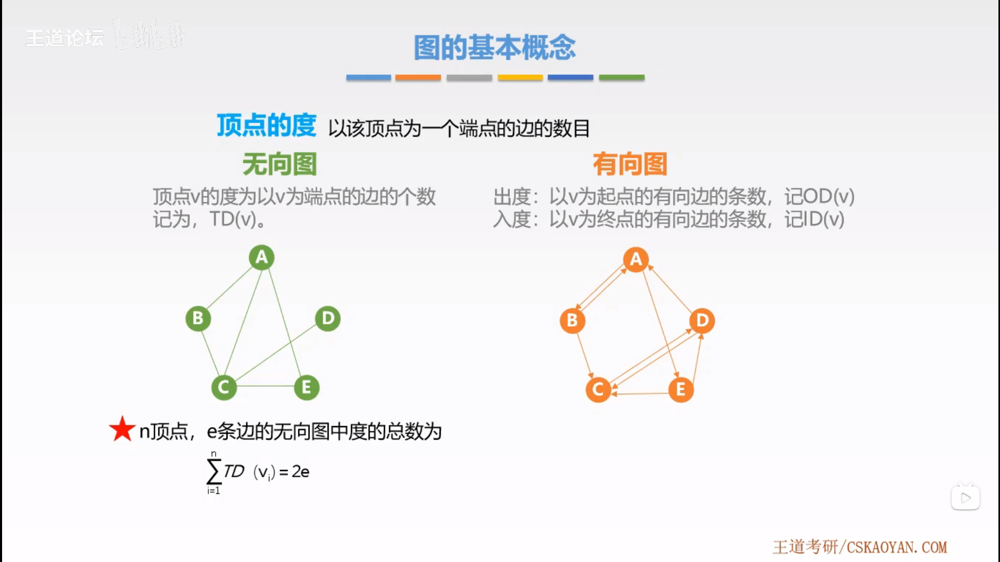

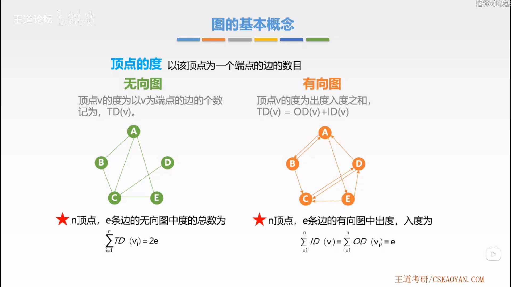

## 11. 网

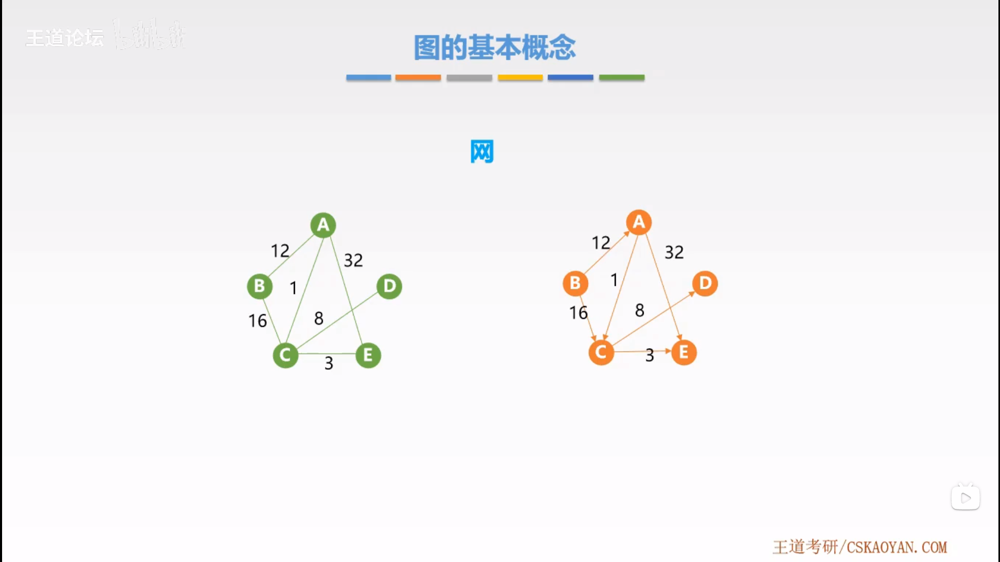

## 12. 稠密图 & 稀疏图

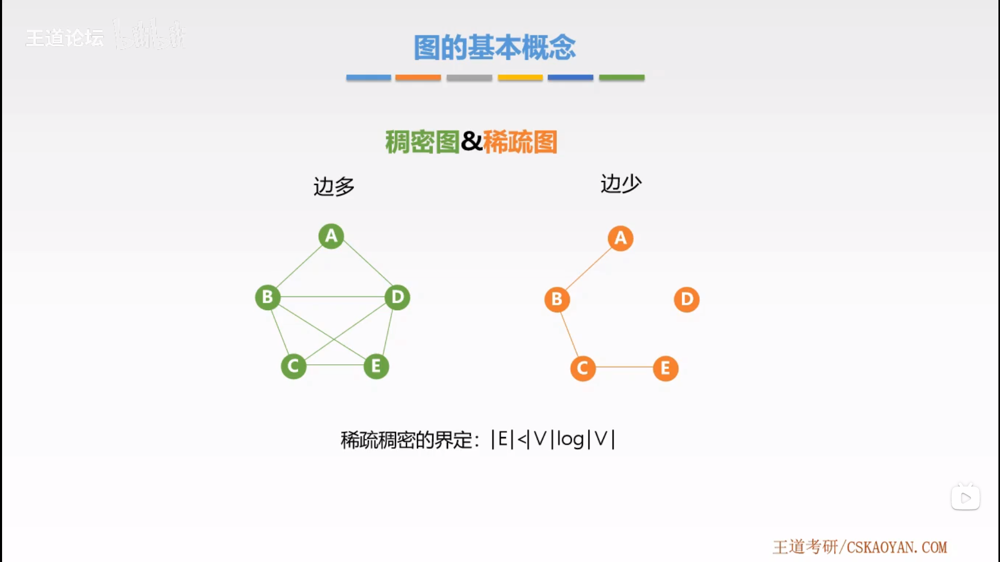

## 13. 有向树

## 14. 路径

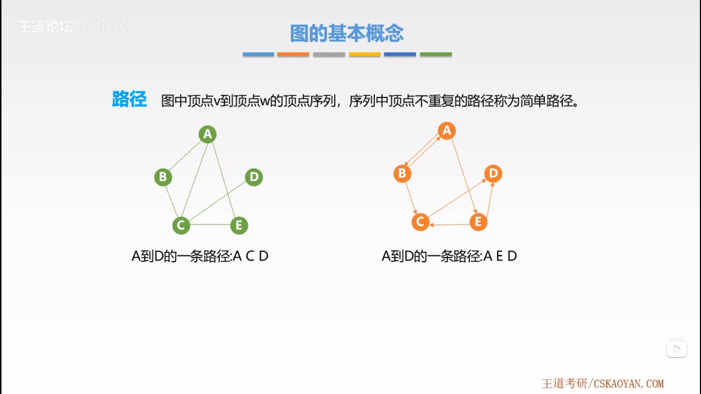

## 15. 路径长度

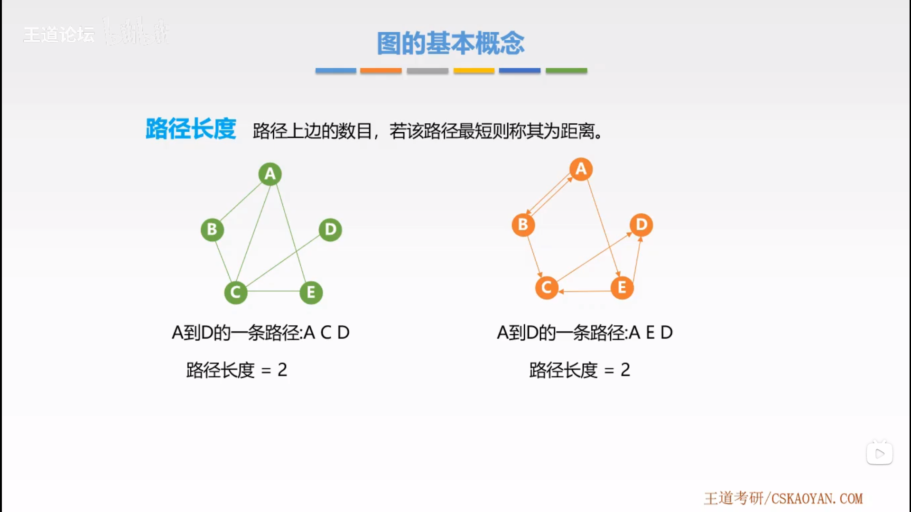

## 16. 回路

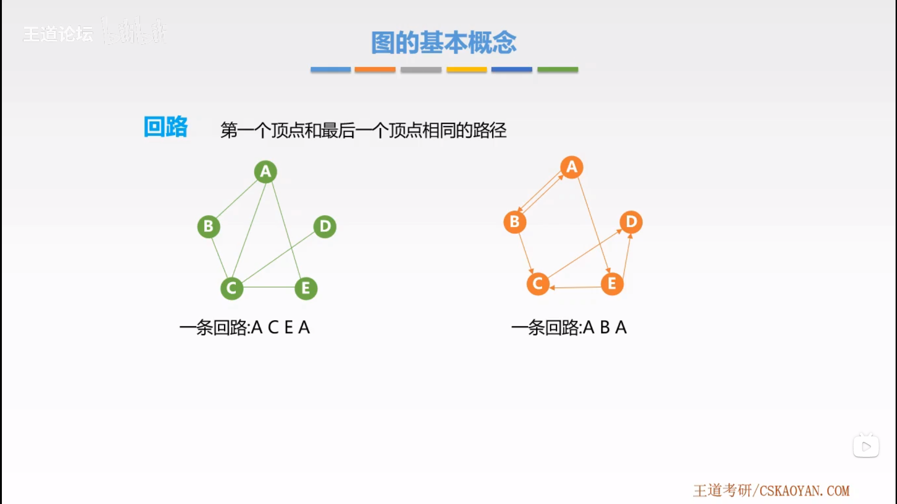
