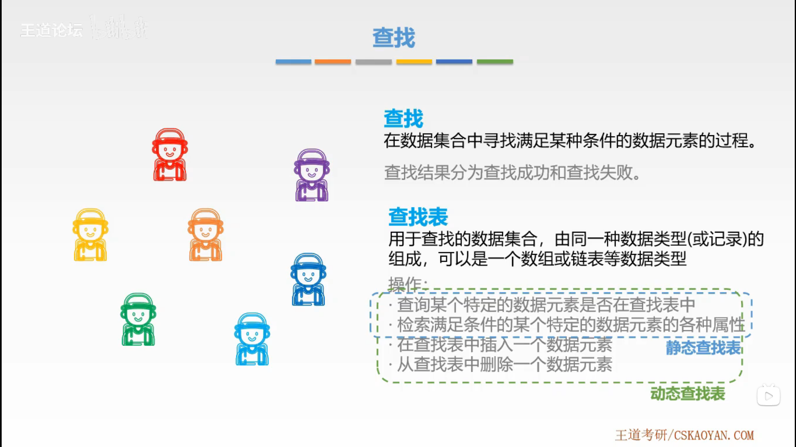
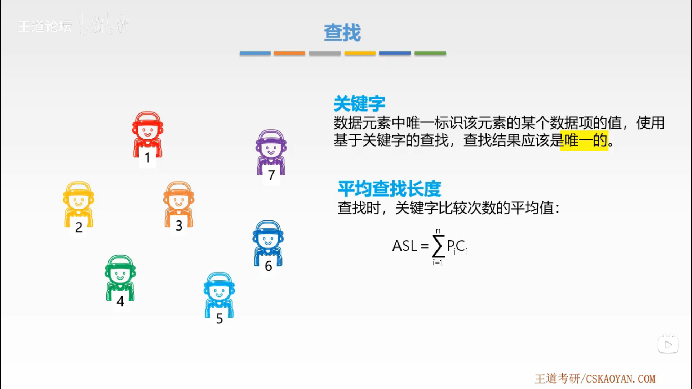
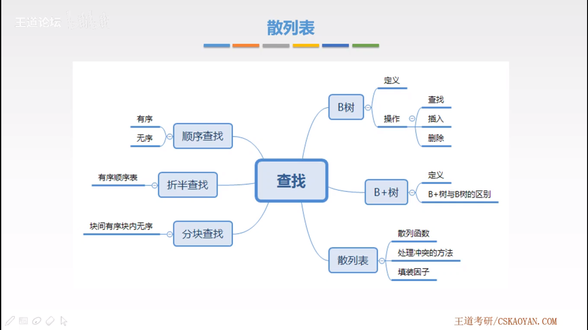

# 查找

## 1. 基本概念

## 2. [顺序查找](sequential-search/README.md#顺序查找)

## 3. [折半查找](binary-search/README.md#折半查找)

## 4. [分块查找](block-search/README.md#分块查找)

## 5. [B 树](b-tree/README.md#B-树)

## 6. [B+ 树](b-plus-tree/README.md#B+-树)

## 7. [散列表](hash-table/README.md#散列表)

