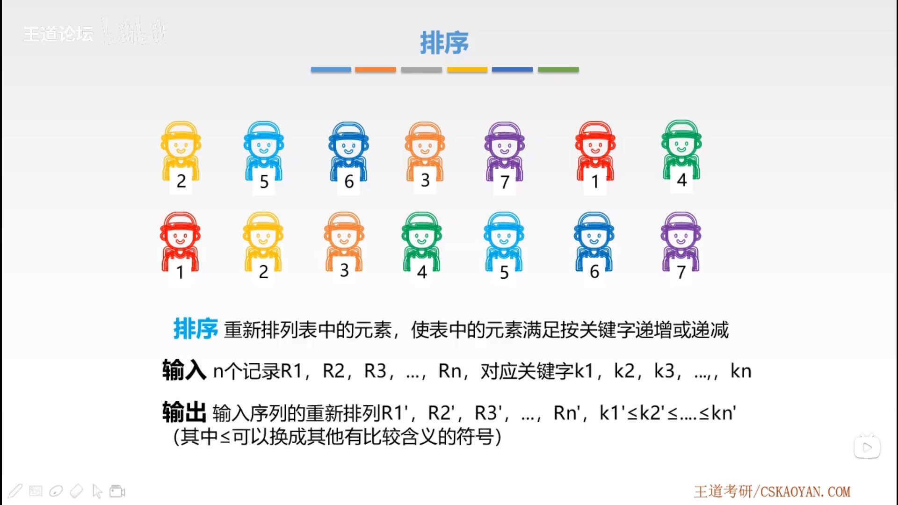
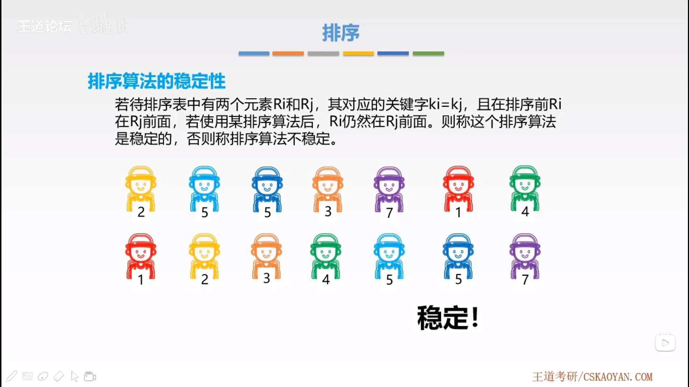
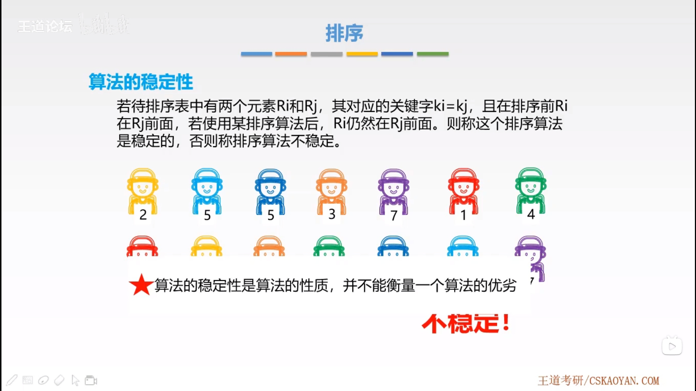
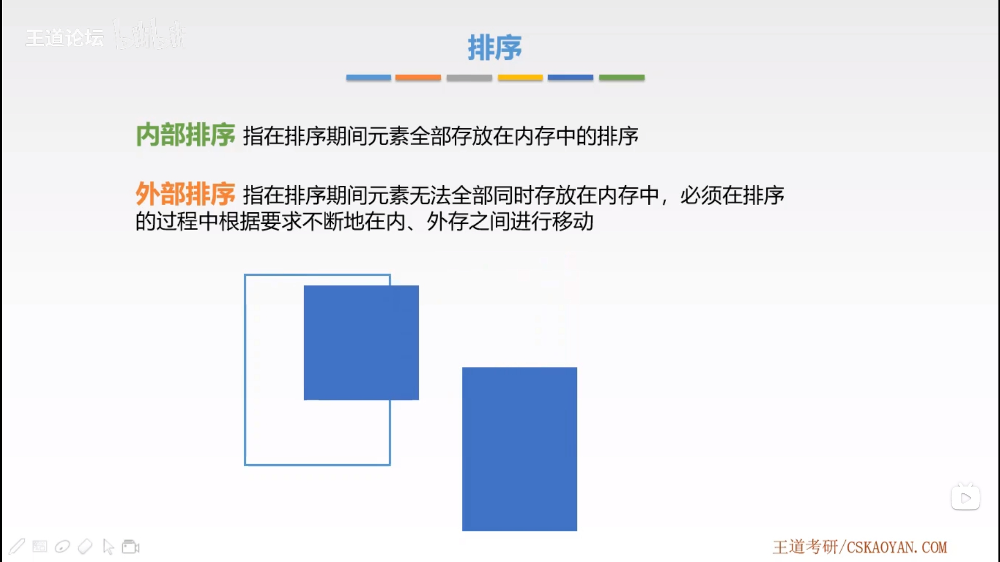
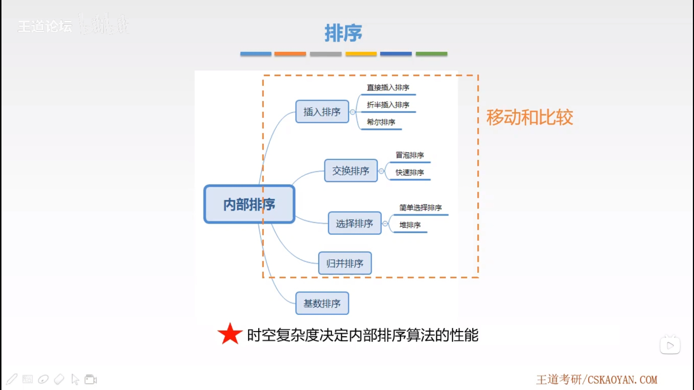
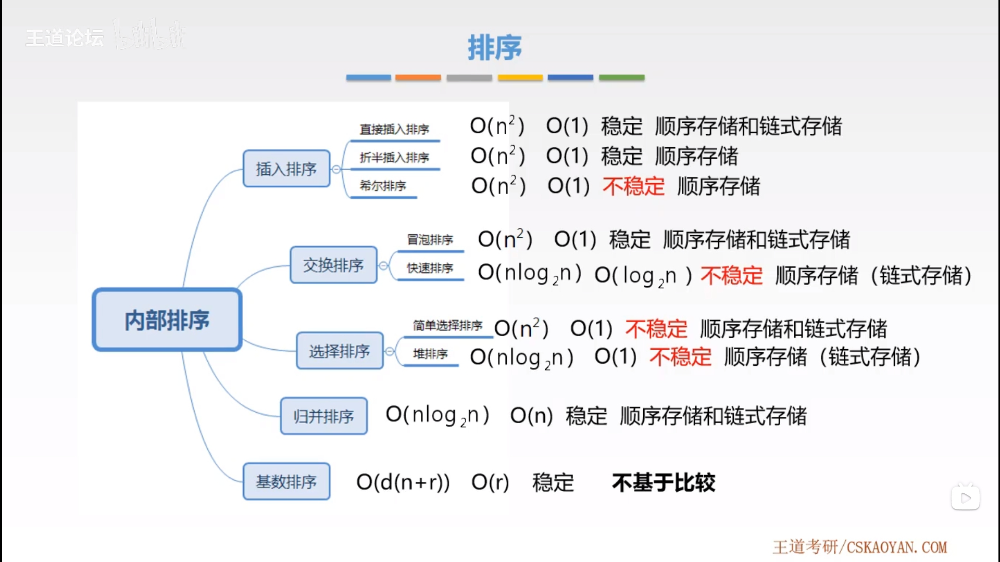
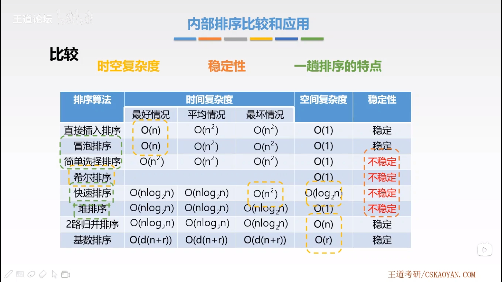
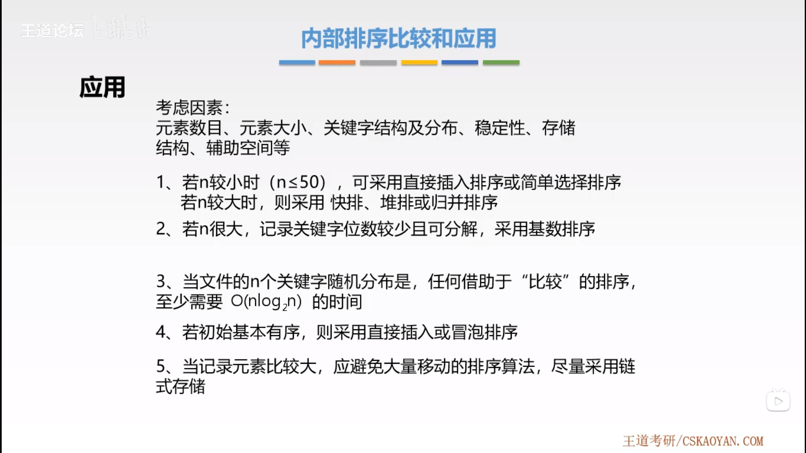

# 排序

## 1. 基本概念

- 排序定义
- 时空复杂度
- 稳定性

## 2. 内部排序算法

- [直接插入排序](direct-insertion-sort/README.md#直接插入排序)
- [折半插入排序](binary-insertion-sort/README.md#折半插入排序)
- [希尔排序](shell-sort/README.md#希尔排序)
- [冒泡排序](bubble-sort/README.md#冒泡排序)
- [快速排序](quick-sort/README.md#快速排序)
- [简单选择排序](simple-selection-sort/README.md#简单选择排序)
- [堆排序](heap-sort/README.md#堆排序)
- [归并排序](merge-sort/README.md#归并排序)
- [基数排序](cardinal-sort/README.md#基数排序)

## 3. [外部排序](external-sort/README.md#外部排序)

- [失败树](external-sort/README.md#1-失败树)
- [置换-选择排序](external-sort/README.md#2-置换-选择排序)
- [最佳归并树](external-sort/README.md#3-最佳归并树)
